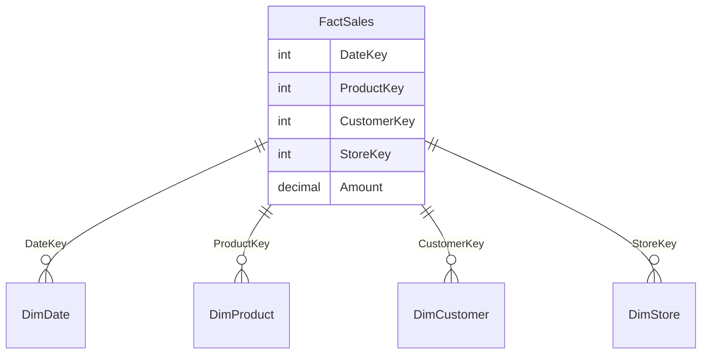
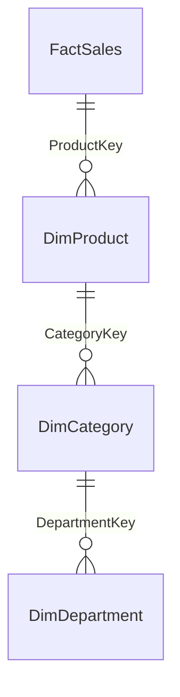
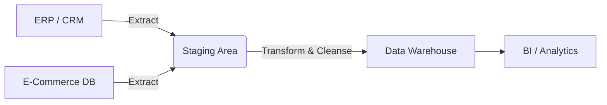
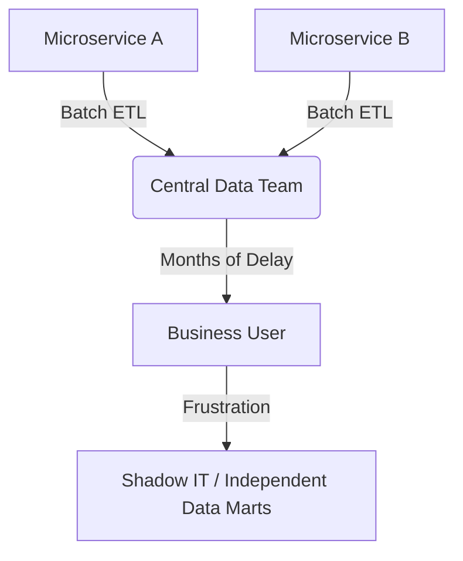
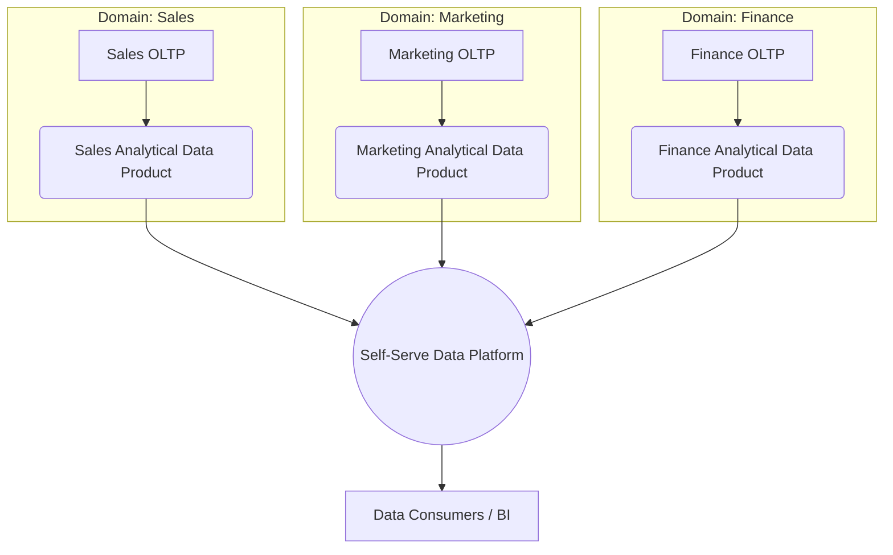

# چرا داده‌ای که برای اجرای سیستم مناسب است، لزوماً برای تحلیل مناسب نیست؟

تصور کنید یک فروشگاه زنجیره‌ای بزرگ دارید. سیستم فروش (OLTP) شما برای ثبت سریع سفارش‌ها، مدیریت موجودی و پردازش تراکنش‌ها طراحی شده است. اما وقتی مدیران از شما می‌پرسند «روند فروش محصولات دسته‌بندی الکترونیک در سه سال گذشته به تفکیک فصل و منطقه جغرافیایی چگونه بوده است؟»، سیستم عملیاتی شما زیر بار این Queryها خم می‌شود و پاسخ درستی هم نمی‌دهد.

**چرا؟** چون معماری داده برای «عملیات» (Operation) با معماری داده برای «تحلیل» (Analytics) تفاوت بنیادین دارد.

این Repository یک مسیر جامع از مفاهیم پایه تا معماری‌های پیشرفته توزیع‌شده (Data Mesh) را طی می‌کند تا به عنوان یک Software/Data Architect بدانید چگونه داده‌ها را از سطح عملیاتی به سطح تحلیلی و در نهایت به سطح دامنه‌های مستقل منتقل کنید.

---

## 📑 Table of Contents
1. [مقدمه‌ای بر Analytical Data](#1-مقدمه‌ای-br-analytical-data)
2. [Fact Table](#2-fact-table)
3. [Dimension Table](#3-dimension-table)
4. [Star Schema](#4-star-schema)
5. [Snowflake Schema](#5-snowflake-schema)
6. [Data Warehouse](#6-data-warehouse)
7. [Data Mart](#7-data-mart)
8. [محدودیت‌های Data Warehouse و Data Mart](#8-محدودیت‌های-data-warehouse-و-data-mart)
9. [مقدمه‌ای بر Data Mesh](#9-مقدمه‌ای-br-data-mesh)
10. [ارتباط DDD و Data Mesh](#10-ارتباط-ddd-و-data-mesh)
11. [جمع‌بندی نهایی و منابع](#11-جمع‌بندی-نهایی-و-منابع)

---

# 1. مقدمه‌ای بر Analytical Data

### 1. تعریف ساده
داده عملیاتی (Operational) مثل «چرخ‌دنده‌های یک ماشین» است که برای حرکت و انجام کار لحظه‌ای استفاده می‌شود. داده تحلیلی (Analytical) مثل «داشبورد و آینه‌های ماشین» است که برای بررسی عملکرد، تصمیم‌گیری و نگاه به گذشته استفاده می‌شود.

### 2. تعریف فنی
*   **1.1. داده عملیاتی (Operational Data):** داده‌ای که در لحظه تولید شده و برای پشتیبانی از تراکنش‌های روزمره کسب‌وکار (Transaction Processing) استفاده می‌شود.
*   **1.2. داده تحلیلی (Analytical Data):** داده‌ای که از منابع عملیاتی استخراج، یکپارچه و ساختاردهی شده تا برای گزارش‌گیری، تحلیل روند و تصمیم‌گیری استراتژیک استفاده شود.
*   **1.4. OLTP (Online Transaction Processing):** معماری پایگاه داده برای تراکنش‌های سریع، کوتاه و اتمیک (مثل ثبت سفارش).
*   **1.5. OLAP (Online Analytical Processing):** معماری پایگاه داده برای Queryهای پیچیده، طولانی و خواندن حجم عظیمی از داده (مثل گزارش فروش سالانه).

### 3. چرا این مفاهیم به وجود آمده‌اند؟
سیستم‌های OLTP بر اساس **Normalization** (حداقل افزونگی) طراحی می‌شوند تا سرعت Write بالا برود و Consistency حفظ شود. اما تحلیل‌ها نیاز به خواندن (Read) حجم زیادی از داده و Join کردن جداول متعدد دارند. اجرای این Queryها روی OLTP باعث قفل شدن جداول (Locking) و افت شدید عملکرد سیستم اصلی می‌شود.

### 4. مثال ساده
*   **OLTP:** وقتی شما در اسنپ یک سفر را ثبت می‌کنید، سیستم باید سریعاً مبدا، مقصد و راننده را در جداول نرمال شده ذخیره کند.
*   **OLAP:** وقتی مدیر اسنپ می‌خواهد بداند «میانگین زمان انتظار مسافران در مناطق ۲۲ گانه تهران در ماه گذشته چقدر بوده»، به سیستم OLAP نیاز دارد.

### 5. مثال ساختاری (تفاوت مدل داده‌ای)
```text
# OLTP Model (Normalized - 3NF)
Users -> Orders -> OrderItems -> Products
                  -> Payments
                  -> Shipments

# OLAP Model (Denormalized - Analytical)
FactSales (Amount, Quantity, DateKey, ProductKey, CustomerKey)
```

### 6. مثال SQL
```sql
-- OLTP Query (Fast, Single Row)
UPDATE Orders SET Status = 'Shipped' WHERE OrderID = 1024;

-- OLAP Query (Slow, Aggregation over millions of rows)
SELECT Region, SUM(SalesAmount) 
FROM FactSales 
GROUP BY Region;
```

### 7. ارتباط با مفاهیم قبلی
این بخش پایه و اساس درک چرایی نیاز به Data Warehouse و Fact/Dimensionها در بخش‌های بعدی است.

### 8. تفاوت با مفاهیم مشابه
| Concept | Purpose | Storage Pattern | Primary Operation |
| :--- | :--- | :--- | :--- |
| **OLTP** | Run the business | Normalized (Row-based) | INSERT / UPDATE / DELETE |
| **OLAP** | Analyze the business | Denormalized (Columnar) | SELECT / AGGREGATE |

### 9. نکات مهم (معماری)
*   هرگز Reportهای سنگین BI را مستقیماً روی دیتابیس OLTP (مثل PostgreSQL یا MySQL عملیاتی) اجرا نکنید.
*   OLTP بر اساس **Current State** است (آخرین وضعیت سفارش)، اما OLAP بر اساس **Historical State** است (تاریخچه تغییرات).

### 10. اشتباهات رایج
*   **اشتباه:** اضافه کردن ایندکس‌های متعدد به جداول OLTP برای حل مشکل کندی Reportها. (این کار سرعت Write را به شدت کاهش می‌دهد).
*   **راه‌حل:** داده را به یک محیط OLAP منتقل کنید.

### 11. جمع‌بندی
داده عملیاتی (OLTP) برای انجام کارهاست و داده تحلیلی (OLAP) برای فهمیدن کارها. به دلیل تفاوت در الگوی خواندن/نوشتن، ما نمی‌توانیم از یک مدل داده‌ای واحد برای هر دو استفاده کنیم.

*(زیربخش‌های 1.3, 1.6, 1.7 در متن بالا ادغام و پوشش داده شدند)*

---

# 2. Fact Table

### 1. تعریف ساده
Fact (واقعیت/فاکت) در دنیای تحلیل، پاسخ به سوال **«چه اتفاقی افتاد و چقدر بود؟»** است. Factها افعال (Verbs) کسب‌وکار هستند؛ مثل «فروش»، «ویزیت»، «ثبت‌نام».

### 2. تعریف فنی
*   **2.1 & 2.2. Fact / Fact Table:** جدولی در مدل تحلیلی که حاوی متریک‌ها (Measures)، مقادیر قابل اندازه‌گیری و Foreign Keyهایی به جداول Dimension است.
*   **2.8. Granularity (Grain):** سطح جزئیات ثبت هر رکورد در Fact. (مثلاً Grain می‌تواند «هر قلم از فاکتور» یا «کل فاکتور» باشد).
*   **2.9. Snapshot:** ثبت وضعیت یک متریک در یک نقطه خاص از زمان (مثل موجودی انبار در پایان هر روز).

### 3. چرا این مفهوم به وجود آمده است؟
برای جدا کردن «متریک‌های قابل اندازه‌گیری» از «توضیحات و زمینه‌ها». این کار باعث می‌شود Engineهای تحلیلی بتوانند روی ستون‌های عددی (مثل Amount) عملیات Aggregate (جمع، میانگین) را با سرعت بالا انجام دهند.

### 4. مثال ساده
*   **فروش:** `FactSales` (مبلغ فروش، تعداد، تاریخ، محصول، مشتری).
*   **درمانی:** `FactPatientVisit` (هزینه ویزیت، مدت زمان انتظار، پزشک، بیمار).
*   **CRM:** `FactLeadConversion` (تعداد روزهای تبدیل لید، هزینه جذب، کمپین منبع).

### 5. مثال ساختاری
```text
FactSales
 ├── DateKey (FK)
 ├── ProductKey (FK)
 ├── CustomerKey (FK)
 ├── StoreKey (FK)
 ├── Quantity (Measure)
 └── SalesAmount (Measure)
```

### 6. مثال SQL
```sql
-- محاسبه کل فروش بر اساس Granularity روزانه
SELECT DateKey, SUM(SalesAmount) as TotalDailySales
FROM FactSales
GROUP BY DateKey;
```

### 7. ارتباط با مفاهیم قبلی
Factها داده‌های خام OLTP را می‌گیرند و آن‌ها را برای محیط OLAP آماده می‌کنند. آن‌ها هسته مرکزی Star Schema هستند.

### 8. تفاوت با مفاهیم مشابه (بسیار مهم)
*   **Fact vs Domain Event:**
    *   **Domain Event (در DDD/Operational):** نشان‌دهنده یک تغییر وضعیت در لحظه است (مثلاً `OrderPlacedEvent`). هدفش تریگر کردن یک پروسه دیگر است.
    *   **Fact (در DW/Analytical):** یک رکورد تاریخی و تحلیلی است. ممکن است از ترکیب چندین Domain Event ساخته شده باشد.
*   **Append-Only بودن (2.6 & 2.7):** Factها معمولاً حذف یا Update نمی‌شوند (Append-Only). چرا؟ چون تاریخچه کسب‌وکار نباید دستکاری شود. اگر سفارشی مرجوع شد، به جای Delete کردن رکورد فروش، یک رکورد جدید با مقدار منفی (Contra Fact) یا تغییر وضعیت در یک Dimension ثبت می‌شود. *(نکته: این یک Best Practice است، نه لزوماً یک قانون فنی غیرقابل نقض در همه معماری‌ها).*

### 9. نکات مهم
*   **Grain** مهم‌ترین تصمیم در طراحی Fact است. اگر Grain را اشتباه انتخاب کنید، مدل شما هرگز نمی‌تواند نیازهای бизнеса را پاسخ دهد.
*   تفاوت **Grain** (سطح جزئیات رکورد) با **Aggregation** (عملیات ریاضی روی داده‌ها) را درک کنید.

### 10. اشتباهات رایج
*   ذخیره کردن نام مشتری یا نام محصول داخل Fact Table (این کار Fact را به Dimension تبدیل می‌کند و انعطاف‌پذیری را از بین می‌برد).
*   تغییر Grain در میانه راه (مثلاً ابتدا Fact را بر اساس OrderItem طراحی کنید، بعداً بخواهید آن را به Order تغییر دهید).

### 11. جمع‌بندی
Fact Table قلب تپنده سیستم تحلیلی است که متریک‌ها و رویدادهای کسب‌وکار را در یک Grain مشخص و به‌صورت تاریخی (Append-Only) ذخیره می‌کند.

*(زیربخش‌های 2.3, 2.4, 2.5, 2.10, 2.11, 2.12 در مثال‌ها و متن بالا پوشش داده شدند)*

---

# 3. Dimension Table

### 1. تعریف ساده
Dimension (بعد/مفهوم) پاسخ به سوالات **«چه کسی؟»، «چه چیزی؟»، «کجا؟» و «کی؟»** است. Dimensionها اسم‌ها (Nouns) و زمینه‌های (Context) کسب‌وکار هستند که به Fact معنا می‌دهند.

### 2. تعریف فنی
*   **3.1 & 3.2. Dimension / Dimension Table:** جدولی که حاوی ویژگی‌های توصیفی (Attributes) است و برای فیلتر کردن، گروه‌بندی (Group By) و برچسب‌گذاری (Labeling) داده‌های Fact استفاده می‌شود.
*   **3.6. Surrogate Key:** یک کلید مصنوعی (معمولاً عدد صحیح) که به جای Primary Key عملیاتی به عنوان شناسه در Dimension استفاده می‌شود تا تغییرات تاریخی (SCD) را مدیریت کند.

### 3. چرا این مفهوم به وجود آمده است؟
برای جدا کردن «توصیفات» از «متریک‌ها». اگر نام محصول در Fact باشد، با هر بار تغییر نام محصول، باید میلیون‌ها رکورد Fact آپدیت شود. با Dimension، نام محصول فقط در یک جدول جداگانه آپدیت می‌شود.

### 4. مثال ساده
*   **DimCustomer:** نام، شهر، رده سنی، تاریخ عضویت.
*   **DimProduct:** نام کالا، دسته‌بندی، برند، رنگ.
*   **DimDate:** سال، فصل، ماه، روز هفته، آیا تعطیل است؟
*   **DimDoctor (درمانی):** نام پزشک، تخصص، بیمارستان محل فعالیت.

### 5. مثال ساختاری
```text
DimProduct
 ├── ProductKey (Surrogate PK)
 ├── ProductID (Operational PK)
 ├── ProductName
 ├── CategoryName
 └── BrandName
```

### 6. مثال SQL
```sql
-- نقش Dimension در فیلتر کردن و Group By
SELECT 
    p.CategoryName, 
    SUM(f.SalesAmount) 
FROM FactSales f
JOIN DimProduct p ON f.ProductKey = p.ProductKey
WHERE p.BrandName = 'Samsung'
GROUP BY p.CategoryName;
```

### 7. ارتباط با مفاهیم قبلی
Dimensionها مکمل Factها هستند. Fact بدون Dimension فقط یک سری عدد بی‌معنی است؛ Dimension به آن اعداد Context می‌دهد.

### 8. تفاوت با مفاهیم مشابه
*   **Fact (Activity) vs Dimension (Context):** Fact نشان می‌دهد «چه اتفاقی» افتاده (فروش)، Dimension نشان می‌دهد این اتفاق در «چه شرایطی» رخ داده (به چه کسی، کجا، کی).

### 9. نکات مهم
*   **SCD (Slowly Changing Dimensions):** ابعاد به مرور تغییر می‌کنند (مثلاً مشتری از تهران به شیراز اسباب‌کشی می‌کند). ما باید بدانیم فروش سال گذشته متعلق به کدام شهر بوده است. برای این کار از تکنیک‌های SCD (مثل Type 2 که رکورد جدید با تاریخ اعتبار می‌سازد) استفاده می‌کنیم.
*   **DimDate** یکی از حیاتی‌ترین ابعاد است که تقریباً در همه Star Schemaها وجود دارد.

### 10. اشتباهات رایج
*   استفاده از Operational ID به جای Surrogate Key در Dimension (این کار مدیریت SCD و یکپارچگی داده‌ها را غیرممکن می‌کند).
*   طراحی Dimensionهای بیش‌ازحد بزرگ (Junk Dimensions) بدون درک نیاز تحلیلگران.

### 11. جمع‌بندی
Dimension Tableها زمینه (Context) و توصیفات لازم برای درک، فیلتر و گروه‌بندی متریک‌های موجود در Fact Tableها را فراهم می‌کنند.

*(زیربخش‌های 3.3, 3.4, 3.5, 3.7 تا 3.13 در مثال‌ها و مفاهیم بالا پوشش داده شدند)*

---

# 4. Star Schema

### 1. تعریف ساده
Star Schema (مدل ستاره‌ای) مثل یک چرخ دوچرخه است. Fact Table در مرکز (توپی چرخ) قرار دارد و Dimension Tableها مثل پره‌ها به آن متصل شده‌اند.

### 2. تعریف فنی
*   **4.1 & 4.2. Star Schema:** یک مدل داده‌ای تحلیلی که در آن یک یا چند Fact Table از طریق Foreign Key به چندین Dimension Table متصل می‌شوند. Dimensionها در این مدل **Denormalized** (غیرنرمال) هستند.

### 3. چرا این مفهوم به وجود آمده است؟
برای **بهینه‌سازی سرعت خواندن (Read Performance)**. در OLAP، تعداد Joinها دشمن اصلی Performance است. Star Schema با تکرار داده‌ها در Dimensionها (Denormalization)، تعداد Joinها را به حداقل می‌رساند.

### 4. مثال ساده
در سیستم فروش، به جای اینکه `DimProduct` به `DimCategory` و `DimBrand` وصل شود (که نرمال است)، نام دسته‌بندی و برند مستقیماً داخل `DimProduct` کپی می‌شوند.

### 5. مثال ساختاری (Mermaid ER Diagram)


### 6. مثال SQL
```sql
-- Query روی Star Schema بسیار ساده و سریع است
SELECT 
    d.StoreName, 
    d.MonthName, 
    SUM(f.Amount) 
FROM FactSales f
JOIN DimStore d ON f.StoreKey = d.StoreKey
JOIN DimDate dt ON f.DateKey = dt.DateKey
GROUP BY d.StoreName, d.MonthName;
```

### 7. ارتباط با مفاهیم قبلی
Star Schema نتیجه نهایی ترکیب صحیح Fact و Dimension برای ایجاد یک محیط OLAP کارآمد است.

### 8. تفاوت با مفاهیم مشابه
*   **Star vs Snowflake:** در Star، Dimensionها غیرنرمال هستند (تکرار داده). در Snowflake، Dimensionها نرمال و به جداول کوچکتر شکسته می‌شوند.

### 9. نکات مهم
*   **مزایا:** سرعت Query فوق‌العاده، سادگی درک برای Business Users و ابزارهای BI.
*   Star Schema استاندارد طلایی (Gold Standard) برای ابزارهایی مثل PowerBI، Tableau و موتورهای MPP است.

### 10. اشتباهات رایج
*   نرمال کردن Dimensionها در Star Schema (که آن را عملاً به Snowflake تبدیل می‌کند و Performance را نابود می‌سازد).
*   ایجاد حلقه (Loop) در ارتباط بین Dimensionها.

### 11. جمع‌بندی
Star Schema با قربانی کردن فضای ذخیره‌سازی (به دلیل Denormalization)، سرعت و سادگی Queryهای تحلیلی را به حداکثر می‌رساند.

*(زیربخش‌های 4.3 تا 4.10 در مفاهیم و مثال‌های بالا ادغام شدند)*

---

# 5. Snowflake Schema

### 1. تعریف ساده
Snowflake Schema (مدل دانه برفی) همان Star Schema است، با این تفاوت که Dimensionهای آن به جداول کوچکتر و نرمال‌شده (Normalized) شکسته شده‌اند و شکلی شبیه به دانه برف پیدا کرده‌اند.

### 2. تعریف فنی
*   **5.3 & 5.4. Normalization در Dimensionها:** شکستن یک Dimension بزرگ به چندین جدول مرتبط (مثلاً جدا کردن `DimCategory` از `DimProduct`).
*   **5.1. Snowflake Schema:** مدلی که در آن Dimensionها در فرم 3NF (Third Normal Form) یا بالاتر نگهداری می‌شوند.

### 3. چرا این مفهوم به وجود آمده است؟
در دهه‌های گذشته که فضای ذخیره‌سازی (Storage) بسیار گران بود، Snowflake برای **کاهش افزونگی داده‌ها (Redundancy)** و حفظ یکپارچگی (Integrity) در سطح Dimensionها ایجاد شد.

### 4. مثال ساختاری (Mermaid)


### 5. ارتباط با مفاهیم قبلی
Snowflake در واقع یک Star Schema است که Dimensionهای آن Normalization شده‌اند.

### 6. تفاوت با مفاهیم مشابه (مقایسه دقیق)
| Feature | Star Schema | Snowflake Schema |
| :--- | :--- | :--- |
| **Normalization** | Denormalized Dimensions | Normalized Dimensions |
| **Query Complexity** | Low (Fewer Joins) | High (More Joins) |
| **Storage** | Higher (Redundancy) | Lower (No Redundancy) |
| **Read Performance** | Excellent | Moderate / Slower |
| **Maintenance** | Easier | Harder (More tables) |

### 7. نکات مهم و Trade-offها
*   **5.7. تأثیر Joinهای بیشتر:** هر Join اضافی در OLAP به معنای مصرف CPU و Memory بیشتر و کند شدن Query است.
*   **5.9 & 5.10. چه زمانی از کدام استفاده کنیم؟**
    *   **Star Schema:** در 95% مواقع، به‌ویژه برای Data Warehouseهای مدرن و ابزارهای BI.
    *   **Snowflake Schema:** زمانی که Dimensionها بسیار بزرگ هستند (مثلاً میلیون‌ها رکورد)، یا زمانی که از یک مدل OLTP موجود برای تحلیل استفاده می‌کنید و فرصت Denormalization ندارید.

### 8. اشتباهات رایج
*   اصرار بر استفاده از Snowflake به دلیل «عادت به نرمال‌سازی در دوران دانشگاه/OLTP». در OLAP، افزونگی داده (Redundancy) یک **ویژگی (Feature)** برای افزایش سرعت است، نه یک باگ.

### 9. جمع‌بندی
Snowflake Schema فضای ذخیره‌سازی را بهینه می‌کند اما به دلیل افزایش تعداد Joinها، معمولاً در معماری‌های مدرن تحلیلی در اولویت دوم نسبت به Star Schema قرار دارد.

---

# 6. Data Warehouse

### 1. تعریف ساده
Data Warehouse (انبار داده) مثل یک «کتابخانه مرکزی» است که کتاب‌ها (داده‌ها) را از منابع مختلف (شعب، سیستم‌های مالی، CRM) جمع‌آوری، مرتب و پاکسازی می‌کند تا همه مدیران از یک نسخه واحد از حقیقت (Single Source of Truth) استفاده کنند.

### 2. تعریف فنی
*   **6.1 & 6.2. Data Warehouse (DW):** یک مخزن داده متمرکز، یکپارچه و تاریخی که از منابع ناهمگن عملیاتی تغذیه می‌شود و برای پشتیبانی از تحلیل‌های سازمانی (Enterprise Analytics) طراحی شده است.
*   **6.3. جایگاه در معماری:** DW در لایه Persistence سیستم‌های تحلیلی قرار می‌گیرد و خروجی آن توسط ابزارهای BI مصرف می‌شود.

### 3. چرا این مفهوم به وجود آمده است؟
سازمان‌ها سیستم‌های جزیره‌ای (Silos) دارند (سیستم فروش، سیستم انبار، سیستم حسابداری). هر کدام تعریف خاص خود را از «مشتری» یا «محصول» دارند. DW ایجاد شد تا این داده‌ها را یکپارچه (Integrated) و سازگار (Consistent) کند.

### 4. مثال ساختاری (مسیر داده)


### 5. مفاهیم کلیدی ETL (6.6 تا 6.15)
*   **Extract:** خواندن داده از منابع OLTP.
*   **Transform:** پاک‌سازی (6.11)، حذف تکراری‌ها (6.13)، حذف داده حساس (Masking - 6.12)، یکسان‌سازی فرمت‌ها (مثلاً تبدیل تاریخ میلادی به شمسی)، و محاسبه Aggregationها (6.15).
*   **Load:** نوشتن در DW.
*   **Staging Area (6.10):** یک محیط موقت که داده‌ها قبل از Transform در آنجا می‌نشینند تا سیستم اصلی درگیر پروسه سنگین ETL نشود.
*   *نکته مدرن:* امروزه به جای ETL، اغلب از **ELT** استفاده می‌شود (داده ابتدا در Cloud DW مثل Snowflake/BigQuery Load می‌شود، سپس با قدرت پردازش ابری Transform می‌گردد).

### 6. ارتباط با مفاهیم قبلی
DW ظرفی است که Star Schemaها و Fact/Dimensionها درون آن پیاده‌سازی می‌شوند.

### 7. تفاوت با مفاهیم مشابه
*   **DW vs Operational DB:** DW تاریخی و Read-Optimized است؛ DB عملیاتی لحظه‌ای و Write-Optimized است.
*   **DW vs Data Lake:** DW ساختاریافته (Structured) و Schema-on-Write است. Data Lake مخزنی برای داده‌های Raw، Semi-structured و Unstructured (مثل لاگ‌ها، تصویر، JSON) با رویکرد Schema-on-Read است.

### 8. نکات مهم (چالش‌های معماری - 6.16 و 6.17)
*   **مشکل Enterprise-Wide Analytical Model:** ساخت یک مدل واحد برای کل سازمان **بسیار دشوار** است. تیم‌های مختلف (مالی، فروش، مارکتینگ) تعاریف متفاوتی از مفاهیم دارند (مثلاً تعریف «سود» در مالی با فروش متفاوت است).
*   ایجاد یک DW متمرکز سازمانی (Corporate DW) ماه‌ها یا سال‌ها زمان می‌برد و اغلب قبل از تکمیل، نیازهای کسب‌وکار تغییر می‌کند.

### 9. اشتباهات رایج
*   استفاده از DW به عنوان یک دیتابیس برای ذخیره داده‌های موقت یا لاگ‌های سیستم (برای این کار Data Lake یا NoSQL مناسب‌تر است).
*   انجام Transformهای پیچیده در Staging به جای استفاده از قدرت پردازشی خودِ DW مدرن (ELT).

### 10. جمع‌بندی
Data Warehouse قلب تپنده تحلیل در سازمان‌های سنتی است که با استفاده از فرآیند ETL/ELT، داده‌های پراکنده را به یک مدل یکپارچه و قابل اعتماد برای تصمیم‌گیری تبدیل می‌کند.

---

# 7. Data Mart

### 1. تعریف ساده
Data Mart مثل یک «مجله یا نشریه تخصصی» است که از محتویات یک کتابخانه بزرگ (DW) فقط برای یک گروه خاص از خوانندگان (مثلاً تیم فروش یا مارکتینگ) گلچین شده است.

### 2. تعریف فنی
*   **7.1 & 7.2. Data Mart:** یک زیرمجموعه از Data Warehouse (یا یک مخزن مستقل) که برای پاسخگویی به نیازهای تحلیلی یک Department، Domain یا Use Case خاص طراحی شده است.
*   **7.14. ارتباط با Star Schema:** Data Martها معمولاً شامل یک یا چند Star Schema مرتبط با همان دامنه هستند.

### 3. چرا این مفهوم به وجود آمده است؟
DW سازمانی بسیار بزرگ و پیچیده است. دسترسی دادن به تمام تیم‌ها به DW خطرناک و کند است. Data Martها سرعت دسترسی را بالا برده و Scope را محدود می‌کنند.

### 4. انواع Data Mart (7.8 و 7.9)
*   **Dependent Data Mart:** از DW مرکزی تغذیه می‌شود (Subsets of DW). این مدل **ایمن و استاندارد** است.
*   **Independent Data Mart:** مستقیماً از سیستم‌های OLTP تغذیه می‌شود (بدون DW مرکزی). این مدل **خطرناک** است و منجر به جزیره‌ای شدن داده‌ها می‌شود.

### 5. مثال ساختاری
```text
Enterprise Data Warehouse
 ├── Sales Data Mart (FactSales, DimCustomer, DimProduct)
 ├── Finance Data Mart (FactLedger, DimAccount, DimCostCenter)
 └── Marketing Data Mart (FactCampaign, DimChannel, DimPromotion)
```

### 6. ارتباط با مفاهیم قبلی
Data Mart لایه‌ای از DW است که Star Schemaهای تخصصی را در اختیار Business Users قرار می‌دهد.

### 7. تفاوت با مفاهیم مشابه
*   **Scope vs Schema:** Data Mart یک Scope (دامنه کاربرد) است، نه لزوماً یک Schema متفاوت. یک Data Mart می‌تواند همان Star Schema باشد اما فقط شامل جداول مرتبط با فروش باشد.

### 8. نکات مهم (مشکلات - 7.16 و 7.17)
*   **ناسازگاری Semantic (Semantic Drift):** اگر تیم فروش و تیم مالی هر کدام Independent Data Mart خود را بسازند، ممکن است «مبلغ فروش» در آن‌ها با هم متفاوت باشد (یکی بدون مالیات، یکی با مالیات). این یعنی از بین رفتن Single Source of Truth.

### 9. اشتباهات رایج
*   ساخت Independent Data Martها توسط تیم‌های مختلف بدون نظارت تیم داده مرکزی (این کار در درازمدت سازمان را فلج می‌کند).

### 10. جمع‌بندی
Data Martها برای چابک‌سازی تحلیل در سطح دپارتمان‌ها استفاده می‌شوند، اما برای حفظ یکپارچگی، باید حتماً به صورت Dependent از یک DW مرکزی تغذیه شوند.

---

# 8. محدودیت‌های Data Warehouse و Data Mart

### 1. تعریف ساده (مشکل کجاست؟)
تصور کنید یک تیم مرکزی «داده» در شرکت دارید که مسئول جمع‌آوری داده از تمام بخش‌ها و ساخت DW است. هر بار که تیم مارکتینگ یک Report جدید می‌خواهد، باید تیکت بزند و ماه‌ها منتظر بماند تا تیم داده آن را بسازد. این یک **گلوگاه (Bottleneck)** عظیم است.

### 2. تعریف فنی (چالش‌های معماری متمرکز)
*   **8.1. Centralized Data Ownership:** داده‌ها متعلق به «تیم داده» هستند، نه متعلق به دامنه‌ای که داده را تولید کرده است.
*   **8.5. Lack of Domain Knowledge:** تیم داده مرکزی ممکن است از پیچیدگی‌های کسب‌وکارِ تیم مارکتینگ یا مالی اطلاع کافی نداشته باشد و تعاریف اشتباهی از داده‌ها ارائه دهد.
*   **8.3 & 8.4. Scalability Issues:** با رشد سازمان، تعداد درخواست‌ها نمایی رشد می‌کند، اما تیم داده مرکزی نمی‌تواند به همان سرعت Scale شود (هم از نظر نیروی انسانی و هم از نظر معماری Monolithic DW).

### 3. چرا این محدودیت‌ها مهم هستند؟
در معماری‌های مدرن که از **Microservices** استفاده می‌کنیم، هر تیم (Domain) دیتابیس و منطق خود را دارد. اما برای Analytics، همه مجبورند داده‌های خود را به یک DW مرکزی بریزند. این یعنی **تضاد بین معماری عملیاتی (توزیع‌شده) و معماری تحلیلی (متمرکز)**.

### 4. مثال ساختاری (مسیر شکست)


### 5. نکات مهم
*   مشکل اصلی DW سنتی **تکنولوژیک** نیست، بلکه **سازمانی (Organizational)** است.
*   مالکیت داده (Data Ownership) در DW سنتی با تیمی است که آن را Transform می‌کند، نه تیمی که آن را تولید کرده است.

### 6. جمع‌بندی
معماری متمرکز DW باعث ایجاد گلوگاه، کاهش چابکی و از بین رفتن مالکیت معنایی داده‌ها توسط دامنه‌های کسب‌وکار می‌شود. این مشکلات زمینه را برای ظهور پارادایم‌های جدید فراهم کرد.

---

# 9. مقدمه‌ای بر Data Mesh

### 1. تعریف ساده
Data Mesh می‌گوید: «به جای اینکه یک تیم مرکزی همه داده‌ها را جمع کند، **هر تیم کسب‌وکاری (Domain) مسئول داده‌های خودش باشد** و آن‌ها را به صورت یک **محصول (Product)** در اختیار بقیه قرار دهد.»

### 2. تعریف فنی
*   **9.1. Data Mesh:** یک رویکرد معماری و سازمانی (Architectural & Organizational Paradigm) برای مدیریت داده در مقیاس بزرگ، که بر اساس توزیع‌شدگی (Decentralization)، مالکیت دامنه‌ای (Domain Ownership) و خودکفایی تیم‌ها طراحی شده است.
*   **9.9. Data as a Product:** داده دیگر یک خروجی جانبی (By-product) پروژه‌ها نیست، بلکه خودِ داده یک محصول نرم‌افزاری است که مشتری (Consumers) دارد، SLA دارد و باید کیفیت، مستندات و Discoverability داشته باشد.

### 3. چرا Data Mesh به وجود آمد؟ (9.2 و 9.3)
برای حل مشکلات بخش 8 (گلوگاه تیم مرکزی، عدم شناخت Domain، مقیاس‌پذیری). Data Mesh معماری تحلیلی را با معماری عملیاتی (Microservices) هم‌راستا می‌کند.

### 4. اصول چهارگانه Data Mesh
1.  **Domain-Oriented Ownership (9.7 & 9.8):** تیم فروش مسئول داده‌های فروش، تیم لجستیک مسئول داده‌های لجستیک.
2.  **Data as a Product (9.9 & 9.10):** هر دامنه باید Analytical Data Productهای باکیفیت، قابل اعتماد و مستند ارائه دهد.
3.  **Self-Serve Data Infrastructure:** یک تیم پلتفرم، زیرساخت (مثل Spark, Iceberg, Airflow) را فراهم می‌کند تا تیم‌های Domain بدون نیاز به دانش عمیق Data Engineering، داده‌های خود را منتشر کنند.
4.  **Federated Computational Governance:** استانداردهای جهانی (مثل امنیت، فرمت‌های مشترک) به صورت خودکار و غیرمتمرکز اعمال می‌شوند.

### 5. مثال ساختاری


### 6. تفاوت با مفاهیم مشابه
| Concept | Paradigm | Ownership | Architecture |
| :--- | :--- | :--- | :--- |
| **Data Warehouse** | Centralized | Central Data Team | Monolithic |
| **Data Lake** | Storage Pattern | Varies | Centralized Storage |
| **Data Mesh** | Decentralized | Domain Teams | Federated / Distributed |

### 7. نکات مهم
*   **Data Mesh یک تکنولوژی یا Database نیست** (9.4). شما نمی‌توانید «Data Mesh بخرید». Data Mesh یک طرز تفکر و معماری سازمانی است که با تکنولوژی‌های مدرن (مثل Data Lakehouse, Apache Iceberg, dbt) پیاده‌سازی می‌شود.
*   **Data Ownership** در اینجا به معنای مالکیت معنایی و کیفیت داده است، نه لزوماً مالکیت فیزیکی سرورها.

### 8. اشتباهات رایج
*   پیاده‌سازی Data Mesh در سازمان‌های کوچک (زیر 100 نفر یا با Domainهای کم). Data Mesh برای سازمان‌های بزرگ و پیچیده (Enterprise) طراحی شده است.
*   فکر کردن به Data Mesh به عنوان یک جایگزین برای Data Warehouse. (شما هنوز به مخازن ذخیره‌سازی نیاز دارید، اما نحوه سازماندهی و مالکیت آن‌ها تغییر می‌کند).

### 9. جمع‌بندی
Data Mesh با شکستن انحصار تیم مرکزی داده و سپردن مالکیت به دامنه‌های کسب‌وکار، داده را به یک Product تبدیل می‌کند تا مقیاس‌پذیری و چابکی سازمان در سطح Enterprise حفظ شود.

---

# 10. ارتباط DDD و Data Mesh

### 1. تعریف ساده
اگر Data Mesh یک «شهر» است که در آن هر محله (Domain) مسئول خانه‌های خودش است، **DDD (Domain-Driven Design)** «قانون اساسی» است که مرزهای این محله‌ها و نحوه ارتباط آن‌ها با هم را مشخص می‌کند.

### 2. تعریف فنی
*   **10.1. Bounded Context و Data Ownership:** در DDD، هر Bounded Context مرزهای مشخصی از کسب‌وکار و زبان مشترک (Ubiquitous Language) دارد. در Data Mesh، هر Bounded Context باید **Analytical Data Product** خود را تولید و منتشر کند.
*   **10.5. Domain-Oriented Architecture:** معماری داده باید بازتابی از معماری نرم‌افزار و مرزهای کسب‌وکار باشد.

### 3. چرا Domain باید داده خودش را بشناسد؟ (10.3)
چون فقط تیمی که در حال نوشتن منطق کسب‌وکار (Business Logic) است، می‌داند که یک «سفارش» دقیقاً چه مفهومی دارد، چه قوانینی بر آن حاکم است و چه زمانی معتبر است. تیم داده مرکزی این Context را نمی‌فهمد.

### 4. ارتباط Bounded Context با Data Product (10.4)
یک Bounded Context (مثلاً «مدیریت ریسک اعتباری») هم خروجی عملیاتی دارد (API برای تایید وام) و هم خروجی تحلیلی (Data Product برای تحلیل نرخ نکول). هر دو باید از یک زبان مشترک (Ubiquitous Language) پیروی کنند.

### 5. مثال ساختاری
```text
Bounded Context: [Order Management]
 ├── Operational: OrderService (PostgreSQL) -> API
 └── Analytical: OrderDataProduct (Iceberg Tables) -> Published to Mesh
 
Bounded Context: [Customer Identity]
 ├── Operational: ProfileService (MongoDB) -> API
 └── Analytical: CustomerDataProduct (Iceberg Tables) -> Published to Mesh
```

### 6. تفاوت با مفاهیم مشابه
*   **Domain vs Bounded Context:** Domain یک حوزه وسیع کسب‌وکار است (مثلاً فروش). Bounded Context مرز مشخصی است که در آن یک مدل دامنه (Domain Model) کاربرد دارد (مثلاً Context صورتحساب در مقابل Context ارسال کالا). Data Productها معمولاً در سطح Bounded Context تعریف می‌شوند.
*   **Data Product vs Database Table:** یک Database Table صرفاً یک ساختار ذخیره‌سازی است. یک Data Product شامل داده، متادیتا، کد کیفیت (Data Quality Tests)، مستندات و SLA است.

### 7. نکات مهم (معماری)
*   Data Mesh **الزاماً** به معنای استفاده از DDD نیست، اما DDD بهترین ابزار مفهومی برای شناسایی مرزهای Domainها در Data Mesh است.
*   در معماری Event-Driven، Domain Eventها می‌توانند به عنوان ورودی برای ساخت Analytical Data Productها در سطح Bounded Context استفاده شوند (CDC یا Event Sourcing).

### 8. اشتباهات رایج
*   تلاش برای ساخت Data Product بر اساس جداول دیتابیس (Table-centric) به جای مفاهیم کسب‌وکار (Domain-centric).
*   نادیده گرفتن تیم‌های عملیاتی و سپردن کامل کار به تیم‌های جدید Data Engineering (در Data Mesh موفق، تیم‌های عملیاتی که Domain را می‌شناسند در تولید Data Product نقش دارند).

### 9. جمع‌بندی
ارتباط DDD و Data Mesh در یک جمله خلاصه می‌شود: **«معماری داده باید از معماری دامنه کسب‌وکار پیروی کند.»** Bounded Contextها مرزهای مالکیت داده را تعیین می‌کنند و Data as a Product خروجی تحلیلی آن‌هاست.

---

# 11. جمع‌بندی نهایی و منابع

## 🗺️ مسیر ذهنی معماری داده
به عنوان یک Architect، شما اکنون می‌توانید این مسیر تکاملی را توضیح دهید:

```text
Operational Data (OLTP)
       ↓ (نیاز به تحلیل و گزارش)
 Analytical Need (OLAP)
       ↓ (انتقال و پاکسازی)
   ETL / ELT Pipeline
       ↓ (ذخیره متمرکز)
Data Warehouse (Enterprise)
       ↓ (مدل‌سازی تحلیلی)
Fact + Dimension
       ↓ (طراحی بهینه خواندن)
Star / Snowflake Schema
       ↓ (تخصص‌سازی برای دپارتمان‌ها)
   Data Mart (Dependent)
       ↓ (مشکلات مقیاس، گلوگاه مرکزی، عدم شناخت Domain)
Data Ownership Problems
       ↓ (تغییر پارادایم از متمرکز به توزیع‌شده)
    Data Mesh (Organizational Shift)
       ↓ (هم‌راستایی با معماری نرم‌افزار)
Domain Ownership (DDD / Bounded Contexts)
       ↓ (داده به عنوان یک خروجی ارزشمند)
Data as a Product
       ↓ (مصرف توسط سایر دامنه‌ها یا BI)
Analytical Data Product
```

## 🎯 پیام نهایی
هدف از یادگیری این مفاهیم، حفظ کردن تعاریف Data Warehouse یا Data Mesh نیست. هدف این است که بدانید:
1.  **چرا** مدل‌های عملیاتی برای تحلیل شکست می‌خورند (OLTP vs OLAP).
2.  **چگونه** با Fact و Dimension و Star Schema این شکست را جبران می‌کنیم.
3.  **چرا** معماری متمرکز (DW) در سازمان‌های بزرگ و چابک به بن‌بست می‌خورد.
4.  **چگونه** با رویکردهای مدرن مثل Data Mesh و الهام از DDD، مالکیت داده را به کسانی برمی‌گردانیم که بهترین شناخت را از آن دارند.

---

## 📚 منابع معتبر (Resources)

برای مطالعه عمیق‌تر و ارجاع در پروژه‌های واقعی، منابع زیر پیشنهاد می‌شوند:

### کتاب‌های مرجع (Data Warehousing & Modeling)
1.  **The Data Warehouse Toolkit**
    *   *نویسنده:* Ralph Kimball, Margy Ross
    *   *کاربرد:* مرجع اصلی طراحی Star Schema، Fact و Dimension. (پاسخ به بخش‌های 2، 3، 4).
    *   [لینک Wiley](https://www.wiley.com/en-us/The+Data+Warehouse+Toolkit%3A+The+Definitive+Guide+to+Dimensional+Modeling%2C+3rd+Edition-p-9781119397625)
2.  **Building the Data Warehouse**
    *   *نویسنده:* W.H. Inmon
    *   *کاربرد:* رویکرد Enterprise و.normalize شده (پاسخ به بخش‌های 5، 6).
3.  **Domain-Driven Design: Tackling Complexity in the Heart of Software**
    *   *نویسنده:* Eric Evans
    *   *کاربرد:* درک Bounded Context و Domain که پایه Data Mesh است (پاسخ به بخش 10).

### مقالات و منابع معماری مدرن (Data Mesh & Architecture)
4.  **Data Mesh: Analytical Data Architectures for the Cloud Era**
    *   *نویسنده:* Zhamak Dehghani (O'Reilly Media)
    *   *کاربرد:* مرجع اصلی و کتاب مرجع Data Mesh.
    *   [لینک O'Reilly](https://www.oreilly.com/library/view/data-mesh/9781098182281/)
5.  **How to Move Beyond a Monolithic Data Lake to a Distributed Data Mesh**
    *   *نویسنده:* Zhamak Dehghani (Martin Fowler's Blog)
    *   *کاربرد:* مقاله پایه‌ای که مفهوم Data Mesh را معرفی کرد.
    *   [لینک Martin Fowler](https://martinfowler.com/articles/data-monolith-to-mesh.html)
6.  **Data Products and the Data Mesh**
    *   *نویسنده:* Zhamak Dehghani
    *   *لینک Martin Fowler](https://martinfowler.com/articles/data-product.html)

### مستندات رسمی پلتفرم‌های ابری و مدرن
7.  **Snowflake Documentation - Data Warehousing & ELT**
    *   [لینک Snowflake](https://docs.snowflake.com/)
    *   *کاربرد:* درک معماری مدرن Cloud DW و ELT.
8.  **Databricks - Lakehouse Architecture**
    *   [لینک Databricks](https://www.databricks.com/glossary/data-lakehouse)
    *   *کاربرد:* درک ترکیب Data Lake و Data Warehouse.
9.  **AWS Well-Architected Data Analytics Lens**
    *   [لینک AWS](https://docs.aws.amazon.com/wellarchitected/latest/data-analytics-lens/data-analytics-lens.html)
    *   *کاربرد:* Best Practiceهای معماری داده در سطح Enterprise.

---
*تولید شده توسط Qwen3.7 | معماری داده از عملیات تا توزیع‌شدگی*