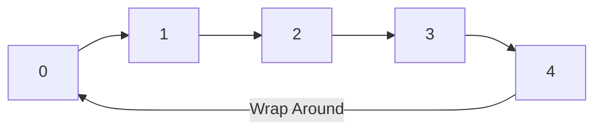

# Circular Buffer در C#

## فهرست مطالب

- [مقدمه](#مقدمه)
- [1. Circular Buffer چیست؟](#1-circular-buffer-چیست)
- [2. پیش‌نیازها](#2-پیشنیازها)
- [3. ساختار داخلی Circular Buffer](#3-ساختار-داخلی-circular-buffer)
- [4. نحوه عملکرد Circular Buffer](#4-نحوه-عملکرد-circular-buffer)
- [5. مفهوم Wrap Around](#5-مفهوم-wrap-around)
- [6. تشخیص Empty و Full](#6-تشخیص-empty-و-full)
- [7. پیاده‌سازی ساده Circular Buffer در C#](#7-پیادهسازی-ساده-circular-buffer-در-c)
- [8. پیاده‌سازی Generic Circular Buffer](#8-پیادهسازی-generic-circular-buffer)
- [9. Overwrite Behavior](#9-overwrite-behavior)
- [10. Circular Buffer با Overwrite](#10-circular-buffer-با-overwrite)
- [11. Circular Buffer و Queue](#11-circular-buffer-و-queue)
- [12. Circular Buffer و Array](#12-circular-buffer-و-array)
- [13. Circular Buffer و Linked List](#13-circular-buffer-و-linked-list)
- [14. Complexity Analysis](#14-complexity-analysis)
- [15. Memory Management](#15-memory-management)
- [16. Circular Buffer برای Reference Typeها](#16-circular-buffer-برای-reference-typeها)
- [17. پیاده‌سازی با Span&lt;T&gt; و Memory&lt;T&gt;](#17-پیادهسازی-با-spant-و-memoryt)
- [18. Circular Buffer و Zero Allocation](#18-circular-buffer-و-zero-allocation)
- [19. Thread Safety](#19-thread-safety)
- [20. Lock-Based Circular Buffer](#20-lock-based-circular-buffer)
- [21. Lock-Free Circular Buffer](#21-lock-free-circular-buffer)
- [22. Circular Buffer و Concurrent Systems](#22-circular-buffer-و-concurrent-systems)
- [23. Circular Buffer در Logging](#23-circular-buffer-در-logging)
- [24. Circular Buffer در Networking](#24-circular-buffer-در-networking)
- [25. Circular Buffer در Audio و Video Streaming](#25-circular-buffer-در-audio-و-video-streaming)
- [26. Circular Buffer در Embedded Systems](#26-circular-buffer-در-embedded-systems)
- [27. مشکلات و Edge Caseها](#27-مشکلات-و-edge-caseها)
- [28. Unit Testing](#28-unit-testing)
- [29. Performance Benchmark](#29-performance-benchmark)
- [30. طراحی یک Circular Buffer حرفه‌ای](#30-طراحی-یک-circular-buffer-حرفهای)
- [31. مقایسه انواع پیاده‌سازی](#31-مقایسه-انواع-پیادهسازی)
- [32. اشتباهات رایج](#32-اشتباهات-رایج)
- [33. Circular Buffer در پروژه‌های واقعی](#33-circular-buffer-در-پروژههای-واقعی)
- [34. خلاصه و راهنمای انتخاب](#34-خلاصه-و-راهنمای-انتخاب)
- [35. تمرین‌ها](#35-تمرینها)
- [36. پروژه پیشنهادی](#36-پروژه-پیشنهادی)
- [منابع](#منابع)

---

## مقدمه

در دنیای برنامه‌نویسی، مدیریت داده‌های موقت یکی از چالش‌های همیشگی است. تصور کنید داده‌هایی به‌صورت مداوم تولید می‌شوند و شما فقط به آخرین N مورد از آن‌ها نیاز دارید. آیا هر بار باید آرایه را جابه‌جا کنید؟ آیا باید حافظه بی‌نهایت اختصاص دهید؟ پاسخ هر دو سؤال «خیر» است. راه‌حل، استفاده از یک **Circular Buffer** (بافر حلقوی) است.

این مقاله آموزشی جامع، مفهوم Circular Buffer را از سطح کاملاً مبتدی تا پیشرفته پوشش می‌دهد. خواننده‌ای که هیچ آشنایی قبلی با این ساختار داده ندارد، در پایان مقاله قادر خواهد بود آن را در C# پیاده‌سازی، تحلیل و در پروژه‌های واقعی استفاده کند.

---

## 1. Circular Buffer چیست؟

### تعریف Circular Buffer

**Circular Buffer** (بافر حلقوی) یک ساختار داده (Data Structure) است که از یک آرایه با اندازه ثابت (Fixed-Size Array) برای ذخیره داده‌ها استفاده می‌کند و رفتاری شبیه به یک **صف (Queue)** دارد. وقتی انتهای آرایه پر می‌شود، نوشتن داده‌ها از ابتدای آرایه ادامه می‌یابد؛ گویی که آرایه به‌صورت دایره‌ای به هم متصل است.

### چرا به آن Circular می‌گوییم؟

زیرا از نظر منطقی، انتهای آرایه به ابتدای آن متصل است. این تصور یک «حلقه» یا «دایره» ایجاد می‌کند. در عمل، آرایه فیزیکی خطی است، اما با استفاده از عملیات **پیمانه‌ای (Modulo)**، اندیس‌ها به‌صورت چرخشی محاسبه می‌شوند.

### مشکل Data Buffer معمولی چیست؟

یک بافر خطی معمولی (Linear Buffer) با آرایه‌ای ساده پیاده‌سازی می‌شود. وقتی داده‌ها خوانده می‌شوند، فضای ابتدای آرایه خالی می‌ماند. برای استفاده مجدد از این فضا باید تمام داده‌های باقی‌مانده را به ابتدای آرایه **جابه‌جا (Shift)** کرد. این عملیات هزینه زمانی `O(n)` دارد.

```text
بافر خطی بعد از خواندن 2 عنصر:
[ _ ][ _ ][ C ][ D ][ E ]
        ↑ باید C,D,E را به ابتدا شیفت دهیم → هزینه O(n)
```

### Circular Buffer چه مشکلی را حل می‌کند؟

Circular Buffer با استفاده از دو نشانگر **Head** (موقعیت خواندن) و **Tail** (موقعیت نوشتن) بدون نیاز به شیفت داده‌ها، فضای خالی ابتدای آرایه را بازیافت می‌کند. هر دو عملیات نوشتن و خواندن در زمان `O(1)` انجام می‌شوند.

### مثال ساده از دنیای واقعی

**سطل زباله گردان رستوران:** تصور کنید یک میز گردان با ۵ جایگاه دارید. غذاها از یک سمت وارد و از سمت دیگر برداشته می‌شوند. وقتی تمام جایگاه‌ها پر شدند، اگر غذای جدیدی بیاید، قدیمی‌ترین غذا از سمت دیگر خارج می‌شود. میز گردان هرگز جابه‌جا نمی‌شود، فقط محل ورود و خروج تغییر می‌کند.

**صف نانوایی:** ۵ نفر در صف هستند. وقتی نفر اول نان می‌گیرد و می‌رود، نفر جدیدی به انتهای صف اضافه می‌شود. در Circular Buffer به جای اینکه همه یک قدم جلو بروند، نشانگر «ابتدای صف» یک قدم جلوتر می‌رود.

### کاربرد صف چرخشی در سیستم‌های نرم‌افزاری

- **سیستم‌های Logging:** نگهداری آخرین N لاگ
- **پردازش صوتی و تصویری:** بافرینگ داده‌های استریم
- **شبکه:** بافر بسته‌های شبکه
- **سیستم‌های Embedded:** ذخیره داده سنسورها
- **بازی‌ها:** ذخیره تاریخچه حرکات بازیکن (Undo)
- **سیستم‌های مانیتورینگ:** نگهداری آخرین مقادیر متریک

---

## 2. پیش‌نیازها

قبل از ورود به پیاده‌سازی، باید با مفاهیم زیر آشنا باشید:

### Array (آرایه)

مجموعه‌ای از عناصر هم‌نوع که در حافظه به‌صورت پیوسته (Contiguous) ذخیره می‌شوند و با **Index** (اندیس) از صفر شروع شده دسترسی دارند.

```csharp
int[] numbers = new int[5]; // آرایه‌ای با ۵ خانه
numbers[0] = 10;            // دسترسی با اندیس ۰
```

### Index (اندیس)

شماره موقعیت هر عنصر در آرایه. در C# اندیس‌ها از `0` شروع می‌شوند.

### Queue (صف)

ساختار داده‌ای که داده‌ها را به ترتیب ورود مدیریت می‌کند. اولین عنصری که وارد شود، اولین عنصری است که خارج می‌شود.

### FIFO (First-In, First-Out)

اصل «اولین ورودی، اولین خروجی». در یک صف FIFO، عنصری که زودتر وارد شده، زودتر هم خارج می‌شود. این اصل پایه Circular Buffer است.

### Fixed Size Buffer (بافر با اندازه ثابت)

بافری که ظرفیت آن در زمان ساخت تعیین می‌شود و بعداً تغییر نمی‌کند. Circular Buffer همیشه Fixed Size است.

### Head (سر)

موقعیتی در بافر که **عملیات خواندن** از آن انجام می‌شود. به آن **Read Position** هم گفته می‌شود. قدیمی‌ترین داده‌ی خوانده‌نشده در Head قرار دارد.

### Tail (دم)

موقعیتی در بافر که **عملیات نوشتن** در آن انجام می‌شود. به آن **Write Position** هم گفته می‌شود. داده بعدی در این موقعیت نوشته خواهد شد.

### Capacity (ظرفیت)

حداکثر تعداد عناصری که بافر می‌تواند نگه دارد. این مقدار ثابت است.

### Count (تعداد)

تعداد عناصر فعلی موجود در بافر. بین `0` و `Capacity` متغیر است.

### تفاوت Queue معمولی و Circular Buffer

| ویژگی | `Queue<T>` | Circular Buffer |
|---|---|---|
| ظرفیت | پویا (Dynamic) - رشد می‌کند | ثابت (Fixed) |
| تخصیص حافظه | ممکن است آرایه جدید بسازد | یک‌بار تخصیص |
| رفتار در حالت پر | رشد می‌کند | خطا یا بازنویسی (Overwrite) |
| GC Pressure | بالاتر (به‌دلیل رشد) | پایین‌تر |
| پیچیدگی Enqueue/Dequeue | سرشکن (Amortized) O(1) | O(1) واقعی |

> **خلاصه:** اگر به صفی با ظرفیت ثابت و عملکرد پایدار نیاز دارید، Circular Buffer مناسب‌تر است. اگر ظرفیت نامشخص است، `Queue<T>` بهتر است.

---

## 3. ساختار داخلی Circular Buffer

یک Circular Buffer با ظرفیت ۵ را در نظر بگیرید:

### Buffer Array

آرایه‌ای با ۵ خانه که داده‌ها در آن ذخیره می‌شوند:

```text
Index:   [0] [1] [2] [3] [4]
Value:   [ ] [ ] [ ] [ ] [ ]
```

### Head / Read Position

نشانگر موقعیت خواندن. ابتدا روی `0` قرار دارد.

### Tail / Write Position

نشانگر موقعیت نوشتن. ابتدا روی `0` قرار دارد.

### Capacity

عدد ثابت `5`.

### Count

تعداد عناصر فعلی. ابتدا `0`.

### Empty State (حالت خالی)

وقتی `Count == 0` است. در این حالت `Head == Tail`.

```text
Empty Buffer (Capacity=5):
Index:  [0] [1] [2] [3] [4]
Value:  [ ] [ ] [ ] [ ] [ ]
         ↑
      Head=Tail=0
      Count=0
```

### Full State (حالت پر)

وقتی `Count == Capacity` است.

```text
Full Buffer (Capacity=5):
Index:  [0] [1] [2] [3] [4]
Value:  [A] [B] [C] [D] [E]
         ↑               ↑
       Head=0          Tail=0 (بعد از Wrap)
       Count=5
```

> **نکته مهم:** در حالت Full با استفاده از Count، هر دو Head و Tail ممکن است برابر باشند (Tail بعد از نوشتن آخرین عنصر به موقعیت Head می‌رسد). بدون Count، تمایز Empty و Full مشکل‌ساز می‌شود (بخش ۶ را ببینید).

### حالت Partially Filled (تا حدی پر)

```text
Partially Filled (3 عنصر):
Index:  [0] [1] [2] [3] [4]
Value:  [A] [B] [C] [ ] [ ]
         ↑           ↑
       Head=0      Tail=3
       Count=3
```

> **خلاصه:** ساختار داخلی شامل یک آرایه، دو نشانگر Head و Tail، و یک شمارنده Count است.

---

## 4. نحوه عملکرد Circular Buffer

فرض کنید `Capacity = 5` و بافر خالی است: `Head=0, Tail=0, Count=0`.

### Write / Enqueue (نوشتن)

افزودن عنصر به انتهای بافر.

**وضعیت اولیه:**
```text
[A] [B] [ ] [ ] [ ]
 ↑       ↑
Head=0  Tail=2, Count=2
```

**عملیات:** `Enqueue("C")`

1. داده `"C"` در `buffer[Tail]` یعنی `buffer[2]` نوشته می‌شود
2. `Tail = (Tail + 1) % Capacity = (2 + 1) % 5 = 3`
3. `Count = Count + 1 = 3`

**وضعیت نهایی:**
```text
[A] [B] [C] [ ] [ ]
 ↑           ↑
Head=0      Tail=3, Count=3
```

### Read / Dequeue (خواندن)

برداشتن عنصر از ابتدای بافر.

**وضعیت اولیه:**
```text
[A] [B] [C] [ ] [ ]
 ↑           ↑
Head=0      Tail=3, Count=3
```

**عملیات:** `Dequeue()` → برمی‌گرداند `"A"`

1. مقدار `buffer[Head]` یعنی `buffer[0]` خوانده می‌شود
2. `Head = (Head + 1) % Capacity = (0 + 1) % 5 = 1`
3. `Count = Count - 1 = 2`

**وضعیت نهایی:**
```text
[ ] [B] [C] [ ] [ ]
     ↑       ↑
   Head=1  Tail=3, Count=2
```

### Peek (نگاه کردن)

مشاهده عنصر ابتدایی بدون حذف آن.

**وضعیت اولیه:** همان حالت بالا.

**عملیات:** `Peek()` → برمی‌گرداند `"B"`

- Head، Tail و Count **تغییر نمی‌کنند**.

### Clear (پاک‌سازی)

حذف تمام عناصر.

**وضعیت اولیه:**
```text
[ ] [B] [C] [ ] [ ]
     ↑       ↑
   Head=1  Tail=3, Count=2
```

**عملیات:** `Clear()`

1. `Head = 0`
2. `Tail = 0`
3. `Count = 0`
4. (اختیاری اما توصیه‌شده) تمام خانه‌های آرایه روی `default(T)` قرار می‌گیرند تا Referenceها آزاد شوند.

**وضعیت نهایی:**
```text
[ ] [ ] [ ] [ ] [ ]
 ↑
Head=Tail=0, Count=0
```

### Reset (بازنشانی)

معادل `Clear` است. Head و Tail به صفر و Count به صفر بازمی‌گردد.

> **خلاصه:** Enqueue در Tail می‌نویسد و Tail را جلو می‌برد. Dequeue از Head می‌خواند و Head را جلو می‌برد. هر دو از Modulo برای چرخش استفاده می‌کنند.

---

## 5. مفهوم Wrap Around

### Wrap Around چیست؟

**Wrap Around** (بازگشت به ابتدا) لحظه‌ای است که نشانگر Head یا Tail به انتهای آرایه می‌رسد و دوباره از اندیس `0` ادامه می‌دهد. این همان چیزی است که بافر را «حلقوی» می‌کند.

### چرا Index دوباره به ابتدای Array برمی‌گردد؟

زیرا بافر اندازه ثابتی دارد و نمی‌توانیم آرایه را بزرگ‌تر کنیم. وقتی انتهای آرایه پر شد، فضای خالی ممکن است در ابتدای آرایه وجود داشته باشد (به‌دلیل Dequeueهای قبلی). به جای شیفت داده‌ها، نشانگر را به ابتدا برمی‌گردانیم.

### چگونه از Modulo `%` استفاده می‌کنیم؟

عملگر **پیمانه (Modulo)** باقی‌مانده تقسیم را برمی‌گرداند. با تقسیم بر `Capacity`، نتیجه همیشه بین `0` تا `Capacity - 1` خواهد بود.

**فرمول حرکت Tail:**
```
Tail = (Tail + 1) % Capacity
```

**فرمول حرکت Head:**
```
Head = (Head + 1) % Capacity
```

### مثال مرحله‌به‌مرحله

```text
Capacity = 5

موقعیت‌های متوالی Tail:
0 → 1 → 2 → 3 → 4 → 0 → 1 → 2 → ...

محاسبات:
(0 + 1) % 5 = 1
(1 + 1) % 5 = 2
(2 + 1) % 5 = 3
(3 + 1) % 5 = 4
(4 + 1) % 5 = 0  ← Wrap Around!
(0 + 1) % 5 = 1
```

### نمایش چرخه با Mermaid



### چرا بعد از رسیدن به انتها از Index صفر ادامه می‌دهیم؟

زیرا آرایه فیزیکی ما اندیس‌های `0` تا `4` دارد. اندیس `5` وجود خارجی ندارد. عملیات `% 5` تضمین می‌کند که هرگز از محدوده آرایه خارج نمی‌شویم و به‌صورت طبیعی به ابتدای آرایه برمی‌گردیم.

> **خلاصه:** Wrap Around قلب Circular Buffer است. با فرمول `(index + 1) % Capacity` پیاده‌سازی می‌شود.

---

## 6. تشخیص Empty و Full

### حالت‌های بافر

| حالت | شرط |
|---|---|
| **Empty** (خالی) | `Count == 0` |
| **Partially Filled** (نیمه‌پر) | `0 < Count < Capacity` |
| **Full** (پر) | `Count == Capacity` |

### روش‌های تشخیص Full و Empty

#### روش اول: استفاده از Count (توصیه‌شده برای مبتدیان)

یک متغیر `Count` نگه می‌داریم.

- **Empty:** `Count == 0`
- **Full:** `Count == Capacity`

| مزایا | معایب |
|---|---|
| ساده و واضح | نیاز به یک متغیر اضافی |
| بدون ابهام | در محیط‌های بدون Lock ممکن است نیاز به `Interlocked` داشته باشد |

#### روش دوم: استفاده از Head و Tail (بدون Count)

بدون متغیر Count، وقتی `Head == Tail` باشد، نمی‌توان تشخیص داد بافر خالی است یا پر.

راه‌حل‌ها:

**الف) یک Slot خالی (Waste One Slot):**

حداکثر `Capacity - 1` عنصر ذخیره می‌کنیم.

- **Empty:** `Head == Tail`
- **Full:** `(Tail + 1) % Capacity == Head`

| مزایا | معایب |
|---|---|
| بدون متغیر اضافی | یک خانه آرایه همیشه هدر می‌رود |
| مناسب برای Lock-Free | ظرفیت مؤثر یک واحد کمتر است |

**ب) استفاده از Flag:**

یک متغیر `bool` به نام `isFull` نگهداری می‌کنیم.

- **Empty:** `Head == Tail && !isFull`
- **Full:** `Head == Tail && isFull`

| مزایا | معایب |
|---|---|
| تمام Capacity قابل استفاده | نیاز به مدیریت Flag |
| بدون هدررفت حافظه | در محیط چندنخی پیچیده‌تر |

> **توصیه:** در بیشتر سناریوهای C#، استفاده از **Count** ساده‌ترین و قابل‌اعتمادترین روش است. در سناریوهای Lock-Free، روش **یک Slot خالی** رایج‌تر است.

---

## 7. پیاده‌سازی ساده Circular Buffer در C#

در این بخش، ساده‌ترین نسخه Circular Buffer را پیاده‌سازی می‌کنیم. این نسخه آموزشی است و تمام جزئیات را آشکارا نشان می‌دهد.

```csharp
public class SimpleCircularBuffer<T>
{
    private readonly T[] _buffer;
    private int _head;   // موقعیت خواندن
    private int _tail;   // موقعیت نوشتن
    private int _count;  // تعداد عناصر فعلی

    // سازنده: ظرفیت بافر را مشخص می‌کند
    public SimpleCircularBuffer(int capacity)
    {
        if (capacity <= 0)
            throw new ArgumentOutOfRangeException(nameof(capacity), "Capacity must be greater than zero.");

        _buffer = new T[capacity];
        _head = 0;
        _tail = 0;
        _count = 0;
    }

    // ظرفیت ثابت بافر
    public int Capacity => _buffer.Length;

    // تعداد عناصر فعلی
    public int Count => _count;

    // آیا بافر خالی است؟
    public bool IsEmpty => _count == 0;

    // آیا بافر پر است؟
    public bool IsFull => _count == _buffer.Length;

    // افزودن عنصر به بافر
    public void Enqueue(T item)
    {
        if (IsFull)
            throw new InvalidOperationException("Buffer is full.");

        _buffer[_tail] = item;
        _tail = (_tail + 1) % _buffer.Length;
        _count++;
    }

    // برداشتن عنصر از بافر
    public T Dequeue()
    {
        if (IsEmpty)
            throw new InvalidOperationException("Buffer is empty.");

        T item = _buffer[_head];
        _buffer[_head] = default!; // آزادسازی Reference (بخش 15 و 16)
        _head = (_head + 1) % _buffer.Length;
        _count--;
        return item;
    }

    // مشاهده عنصر ابتدایی بدون حذف
    public T Peek()
    {
        if (IsEmpty)
            throw new InvalidOperationException("Buffer is empty.");

        return _buffer[_head];
    }

    // پاک‌سازی بافر
    public void Clear()
    {
        if (RuntimeHelpers.IsReferenceOrContainsReferences<T>())
        {
            Array.Clear(_buffer, 0, _buffer.Length);
        }
        _head = 0;
        _tail = 0;
        _count = 0;
    }
}
```

### توضیح کد بخش‌به‌بخش

| بخش | توضیح |
|---|---|
| `_buffer` | آرایه داخلی که داده‌ها را نگه می‌دارد |
| `_head` | اندیس عنصر بعدی برای خواندن |
| `_tail` | اندیس مکان بعدی برای نوشتن |
| `_count` | تعداد عناصر فعلی |
| `Enqueue` | در `_tail` می‌نویسد، سپس `_tail` را با Modulo جلو می‌برد |
| `Dequeue` | از `_head` می‌خواند، سپس `_head` را با Modulo جلو می‌برد |
| `default!` | برای Reference Typeها، Reference قبلی را null می‌کند تا GC بتواند آن را جمع‌آوری کند |
| `RuntimeHelpers.IsReferenceOrContainsReferences<T>()` | (از .NET 6+) بررسی می‌کند آیا T شامل Reference است. فقط در این صورت `Array.Clear` لازم است |

> **نکته:** عبارت `RuntimeHelpers.IsReferenceOrContainsReferences<T>()` در فضای نام `System.Runtime.CompilerServices` قرار دارد و از .NET 6 به بعد در دسترس است. در نسخه‌های قدیمی‌تر می‌توانید همیشه `Array.Clear` را صدا بزنید (هزینه اضافی برای Value Typeها ناچیز است).

---

## 8. پیاده‌سازی Generic Circular Buffer

### چرا Circular Buffer باید Generic باشد؟

یک Circular Buffer غیر-generic فقط می‌تواند یک نوع خاص (مثلاً `int`) را نگه دارد. اگر بخواهیم `string`، `double` یا یک کلاس سفارشی ذخیره کنیم، باید برای هر نوع یک کلاس جداگانه بنویسیم. با استفاده از **Generic** (نوع عمومی)، یک پیاده‌سازی واحد برای همه انواع قابل استفاده است.

### مثال استفاده

```csharp
// بافر اعداد صحیح
var intBuffer = new SimpleCircularBuffer<int>(10);
intBuffer.Enqueue(42);

// بافر رشته‌ها
var stringBuffer = new SimpleCircularBuffer<string>(5);
stringBuffer.Enqueue("Hello");

// بافر اشیاء سفارشی
public class MyObject
{
    public int Id { get; set; }
    public string Name { get; set; } = string.Empty;
}

var objectBuffer = new SimpleCircularBuffer<MyObject>(3);
objectBuffer.Enqueue(new MyObject { Id = 1, Name = "Test" });
```

### مزایای Generic بودن

| مزیت | توضیح |
|---|---|
| **Type Safety** (امنیت نوع) | کامپایلر از صحت نوع داده اطمینان حاصل می‌کند |
| **بازاستفاده کد** | یک پیاده‌سازی برای همه انواع |
| **بدون Boxing/Unboxing** | برای Value Typeها مانند `int`، هزینه تبدیل به `object` وجود ندارد |
| **خوانایی** | `CircularBuffer<int>` واضح‌تر از `CircularBuffer` با `object` است |

> **خلاصه:** Generic بودن Circular Buffer امکان استفاده Type-Safe و بدون هزینه Boxing را برای هر نوع داده فراهم می‌کند.

---

## 9. Overwrite Behavior

وقتی بافر پر است و داده جدیدی وارد می‌شود، دو رفتار ممکن است:

### حالت اول: Reject (رد کردن)

داده جدید پذیرفته نمی‌شود و یک استثنا (Exception) پرتاب می‌شود. این رفتار در کد بخش ۷ پیاده‌سازی شده است:

```csharp
public void Enqueue(T item)
{
    if (IsFull)
        throw new InvalidOperationException("Buffer is full.");
    // ...
}
```

### حالت دوم: Overwrite (بازنویسی)

قدیمی‌ترین داده (عنصری که در Head قرار دارد) حذف می‌شود و داده جدید جایگزین آن می‌گردد. Head نیز یک قدم جلو می‌رود.

```csharp
public void EnqueueOverwrite(T item)
{
    _buffer[_tail] = item;
    _tail = (_tail + 1) % _buffer.Length;

    if (_count == _buffer.Length)
    {
        // بافر پر بود: قدیمی‌ترین عنصر از بین رفت
        _head = (_head + 1) % _buffer.Length;
        // Count تغییر نمی‌کند زیرا یک عنصر حذف و یک عنصر اضافه شد
    }
    else
    {
        _count++;
    }
}
```

### مقایسه

| رفتار | مزیت | عیب |
|---|---|---|
| Reject | داده‌ای از دست نمی‌رود (خطا اعلام می‌شود) | برنامه باید خطا را مدیریت کند |
| Overwrite | هرگز مسدود نمی‌شود، همیشه فضا دارد | داده قدیمی بدون اطلاع حذف می‌شود |

---

## 10. Circular Buffer با Overwrite

### مثال مرحله‌به‌مرحله

فرض کنید بافر با ظرفیت ۵ پر است:

```text
Initial State (Full):
Index:  [0] [1] [2] [3] [4]
Value:  [A] [B] [C] [D] [E]
         ↑
      Head=0, Tail=0, Count=5
```

**عملیات:** `EnqueueOverwrite("F")`

1. `_buffer[Tail]` یعنی `_buffer[0] = "F"` → `"A"` بازنویسی می‌شود
2. `Tail = (0 + 1) % 5 = 1`
3. چون `Count == Capacity` (یعنی ۵ == ۵):
   - `Head = (0 + 1) % 5 = 1` (Head هم جلو می‌رود)
   - Count تغییر نمی‌کند (همچنان ۵)

**وضعیت نهایی:**
```text
After Overwrite:
Index:  [0] [1] [2] [3] [4]
Value:  [F] [B] [C] [D] [E]
             ↑
          Head=1, Tail=1, Count=5
```

داده `"A"` (قدیمی‌ترین) حذف شد و `"F"` (جدیدترین) جایگزین آن شد.

### تغییرات Head و Tail

| مرحله | Head | Tail | Count | توضیح |
|---|---|---|---|---|
| قبل | 0 | 0 | 5 | بافر پر، Head==Tail |
| نوشتن F در buffer[0] | 0 | 0 | 5 | بازنویسی روی موقعیت Tail |
| جلو بردن Tail | 0 | 1 | 5 | Tail = (0+1)%5 |
| جلو بردن Head | 1 | 1 | 5 | Head = (0+1)%5 (چون پر بود) |

> **خلاصه:** در حالت Overwrite، وقتی بافر پر است، Tail و Head هر دو یک قدم جلو می‌روند. Count ثابت می‌ماند.

---

## 11. Circular Buffer و Queue

| ویژگی | `CircularBuffer<T>` | `Queue<T>` |
|---|---|---|
| **Data Structure** | آرایه با اندیس چرخشی | آرایه حلقوی داخلی (در .NET) |
| **Memory Allocation** | یک‌بار تخصیص | ممکن است هنگام رشد آرایه جدید بسازد |
| **Fixed Capacity** | بله | خیر (پویا رشد می‌کند) |
| **Dynamic Growth** | خیر | بله |
| **Performance** | O(1) واقعی برای Enqueue/Dequeue | O(1) سرشکن (Amortized) |
| **Memory Usage** | ثابت و قابل پیش‌بینی | متغیر |
| **API** | ساده‌تر | استاندارد .NET |
| **کاربرد** | بافر ثابت، استریمینگ، Embedded | صف‌بندی عمومی |
| **Thread Safety** | به‌صورت پیش‌فرض خیر | به‌صورت پیش‌فرض خیر |
| **Overwrite** | قابل پیاده‌سازی | پشتیبانی نمی‌کند |

### چه زمانی Queue مناسب‌تر است؟
- وقتی تعداد عناصر نامشخص است
- وقتی رشد پویا مورد نیاز است
- وقتی از API استاندارد .NET می‌خواهید استفاده کنید

### چه زمانی Circular Buffer مناسب‌تر است؟
- وقتی ظرفیت حداکثر مشخص و ثابت است
- وقتی نیاز به Overwrite دارید
- وقتی می‌خواهید تخصیص حافظه را کنترل کنید
- در سیستم‌های Real-Time و Embedded

> **نکته جالب:** پیاده‌سازی داخلی `Queue<T>` در .NET Runtime خود از یک آرایه حلقوی استفاده می‌کند! اما تفاوت کلیدی این است که `Queue<T>` وقتی آرایه‌اش پر می‌شود، آرایه بزرگ‌تری تخصیص می‌دهد و داده‌ها را کپی می‌کند (رشد پویا)، در حالی که Circular Buffer ما این کار را نمی‌کند.

---

## 12. Circular Buffer و Array

| ویژگی | Circular Buffer | Array معمولی |
|---|---|---|
| **Memory Layout** | پیوسته (Contiguous) | پیوسته |
| **Access Pattern** | ترتیبی (Sequential) با چرخش | تصادفی (Random) با اندیس |
| **Insert (در انتها)** | O(1) | O(1) (اگر فضا باشد) |
| **Remove (از ابتدا)** | O(1) | O(n) (نیاز به شیفت) |
| **FIFO** | بله (ذاتی) | خیر (باید دستی مدیریت شود) |
| **Fixed Capacity** | بله | بله |
| **Index Management** | خودکار با Head/Tail/Modulo | دستی |

---

## 13. Circular Buffer و Linked List

| ویژگی | Array-based Circular Buffer | Linked List |
|---|---|---|
| **Memory Overhead** | پایین (فقط آرایه + ۳ int) | بالا (هر گره شامل اشاره‌گر Next است) |
| **Cache Locality** | عالی (حافظه پیوسته) | ضعیف (گره‌ها پراکنده در Heap) |
| **Allocation** | یک‌بار | برای هر عنصر یک تخصیص |
| **Performance** | بالاتر | پایین‌تر |
| **Insert/Delete** | O(1) | O(1) برای ابتدا/انتها |
| **Fixed Size** | بله | خیر |
| **Sequential Access** | عالی | متوسط |

### چرا Array-based Circular Buffer معمولاً بهتر است؟

1. **Cache Locality (موضعی بودن کش):** پردازنده داده‌های پیوسته را بهتر در Cache نگه می‌دارد.
2. **کاهش Allocation:** فقط یک آرایه تخصیص داده می‌شود، نه صدها گره.
3. **کاهش GC Pressure:** اشیاء کمتری برای Garbage Collector وجود دارد.

> **خلاصه:** در سناریوهای بافر، Array-based Circular Buffer به‌دلیل Cache Locality و Allocation کمتر، تقریباً همیشه بهتر از Linked List است.

---

## 14. Complexity Analysis

| عملیات | پیچیدگی زمانی | پیچیدگی فضایی | توضیح |
|---|---|---|---|
| **Enqueue** | O(1) | O(1) | نوشتن در اندیس مشخص و محاسبه Modulo |
| **Dequeue** | O(1) | O(1) | خواندن از اندیس مشخص و محاسبه Modulo |
| **Peek** | O(1) | O(1) | خواندن یک اندیس |
| **Clear** | O(n) | O(1) | صفر کردن آرایه (در صورت وجود Reference) |
| **IsEmpty** | O(1) | O(1) | مقایسه Count با صفر |
| **IsFull** | O(1) | O(1) | مقایسه Count با Capacity |

### چرا Enqueue و Dequeue در O(1) هستند؟

- **Enqueue:** فقط یک نوشتن در آرایه (`buffer[tail] = item`)، یک عملیات جمع و Modulo، و یک افزایش Count. هیچ‌کدام وابسته به تعداد عناصر نیستند.
- **Dequeue:** فقط یک خواندن از آرایه، یک عملیات جمع و Modulo، و یک کاهش Count.
- هیچ حلقه‌ای روی عناصر وجود ندارد. هیچ شیفتی لازم نیست.

---

## 15. Memory Management

### نحوه استفاده Circular Buffer از Memory

| موضوع | توضیح |
|---|---|
| **Fixed Allocation** | آرایه فقط یک‌بار در سازنده تخصیص داده می‌شود |
| **Heap Allocation** | آرایه Reference Typeها و آرایه Value Typeهای بزرگ روی Heap قرار می‌گیرند |
| **Array** | یک شیء پیوسته در حافظه |
| **Garbage Collection** | آرایه تا زمانی که Circular Buffer زنده است، جمع‌آوری نمی‌شود |
| **Object References** | اگر `T` یک Reference Type باشد، هر خانه آرایه یک اشاره‌گر (Reference) به شیء نگه می‌دارد |
| **Clearing References** | هنگام Dequeue یا Clear، باید Referenceهای قدیمی را `null` (یا `default`) کنیم |
| **Memory Retention** | اگر Referenceها پاک نشوند، اشیاء قدیمی توسط GC جمع‌آوری نمی‌شوند حتی اگر دیگر از آن‌ها استفاده نمی‌شود |

### اهمیت Clearing References

```csharp
CircularBuffer<object> buffer = new CircularBuffer<object>(5);
buffer.Enqueue(new LargeObject()); // شیء بزرگ ایجاد شد
buffer.Dequeue();                  // عنصر خارج شد
// اگر buffer[head] را null نکنیم، LargeObject هنوز از طریق آرایه قابل دسترسی است
// و Garbage Collector نمی‌تواند آن را آزاد کند → Memory Leak!
```

به همین دلیل در کد بخش ۷، خط `_buffer[_head] = default!;` وجود دارد.

---

## 16. Circular Buffer برای Reference Typeها

### Value Type (نوع مقداری) در برابر Reference Type (نوع مرجعی)

| ویژگی | Value Type (`int`, `double`, `struct`) | Reference Type (`string`, `class`) |
|---|---|---|
| **ذخیره در آرایه** | مقدار مستقیماً ذخیره می‌شود | اشاره‌گر (Reference) ذخیره می‌شود |
| **حافظه** | Stack یا داخل آرایه | Heap |
| **Garbage Collection** | نیازی نیست | لازم است |
| **خطر Memory Leak** | خیر | بله (اگر Reference پاک نشود) |

### مثال

```csharp
// Value Type: مقدار 42 مستقیماً در buffer[0] ذخیره می‌شود
var intBuffer = new SimpleCircularBuffer<int>(5);
intBuffer.Enqueue(42);

// Reference Type: اشاره‌گر به شیء MyObject در buffer[0] ذخیره می‌شود
var objBuffer = new SimpleCircularBuffer<MyObject>(5);
objBuffer.Enqueue(new MyObject { Id = 1 });
```

وقتی از `objBuffer.Dequeue()` استفاده می‌کنیم، اگر `buffer[head]` را `null` نکنیم، اشاره‌گر همچنان در آرایه وجود دارد و شیء `MyObject` در حافظه باقی می‌ماند.

### راه‌حل

همان‌طور که در بخش ۷ دیدیم:
```csharp
_buffer[_head] = default!; // برای Reference Typeها: null، برای Value Typeها: مقدار پیش‌فرض
```

> **خلاصه:** برای Reference Typeها، حتماً پس از Dequeue یا Overwrite، Reference قدیمی را پاک کنید تا از Memory Leak جلوگیری شود.

---

## 17. پیاده‌سازی با Span\<T\> و Memory\<T\>

### Span\<T\> و Memory\<T\> چیستند؟

**`Span<T>`** و **`Memory<T>`** (معرفی‌شده در .NET Core 2.1 / .NET Standard 2.1) انواعی هستند که نمای (View) پیوسته‌ای از یک ناحیه حافظه را ارائه می‌دهند بدون اینکه مالک آن حافظه باشند.

### کاربرد در Circular Buffer

در Circular Buffer، وقتی داده‌ها **Wrap Around** کرده‌اند، داده‌های منطقی در **دو بخش غیرپیوسته** قرار دارند:

```text
Logical Order: [C] [D] [E] [A] [B]
Physical Array: [A] [B] [C] [D] [E]
                      ↑       ↑
                   (Segment 2) (Segment 1)

Segment 1: از Head تا انتهای آرایه
Segment 2: از ابتدای آرایه تا Tail
```

یک `Span<T>` تنها می‌تواند یک ناحیه **پیوسته** را نمایش دهد. بنابراین نمی‌توان کل محتوای یک Circular Buffer که Wrap Around کرده را در یک `Span<T>` واحد نمایش داد.

### راه‌حل: دو Span

```csharp
public void GetSpans(out ReadOnlySpan<T> first, out ReadOnlySpan<T> second)
{
    if (_count == 0)
    {
        first = ReadOnlySpan<T>.Empty;
        second = ReadOnlySpan<T>.Empty;
        return;
    }

    if (_head < _tail)
    {
        // داده‌ها پیوسته هستند
        first = _buffer.AsSpan(_head, _count);
        second = ReadOnlySpan<T>.Empty;
    }
    else
    {
        // داده‌ها دو بخشی هستند (Wrap Around)
        int firstLength = _buffer.Length - _head;
        first = _buffer.AsSpan(_head, firstLength);
        second = _buffer.AsSpan(0, _tail);
    }
}
```

### محدودیت‌ها

| محدودیت | توضیح |
|---|---|
| **عدم پیوستگی** | وقتی Wrap Around رخ داده، یک Span واحد کافی نیست |
| **Span در Heap** | `Span<T>` نمی‌تواند فیلد یک کلاس باشد (فقط `ref struct`). باید از `Memory<T>` استفاده کنید |
| **Ref Struct** | `Span<T>` نمی‌تواند در `async` متدها یا `IEnumerable` استفاده شود |

### چه زمانی استفاده کنیم؟

- **مفید:** وقتی می‌خواهید بخشی از بافر را بدون کپی به یک متد پاس بدهید (مثلاً برای `Stream.Write`)
- **کافی نیست:** وقتی به یک API نیاز دارید که کل بافر را یکجا بخواهد و Wrap Around رخ داده باشد
- **Array ساده کافی است:** وقتی نیاز به Zero-Allocation ندارید یا بافر کوچک است

---

## 18. Circular Buffer و Zero Allocation

### مفهوم Zero Allocation

**Zero Allocation** (بدون تخصیص) به تکنیک‌هایی گفته می‌شود که از ایجاد اشیاء جدید روی Heap جلوگیری می‌کنند. هدف، کاهش فشار روی **Garbage Collector** (GC) و افزایش **Throughput** (توان عملیاتی) است.

### چگونه Circular Buffer به کاهش Allocation کمک می‌کند؟

| تکنیک | توضیح |
|---|---|
| **Object Pooling** | اشیاء استفاده‌شده را دور نمی‌اندازیم، بلکه در بافر بازیافت می‌کنیم |
| **Array Reuse** | آرایه یک‌بار ساخته می‌شود و بارها استفاده می‌شود |
| **Allocation Reduction** | در حالت Overwrite، آرایه جدیدی ساخته نمی‌شود |
| **GC Pressure** | کاهش تعداد اشیاء کوتاه‌عمر |
| **High Throughput** | مناسب برای سیستم‌هایی که میلیون‌ها عملیات در ثانیه انجام می‌دهند |

### مثال عملی: استخر اشیاء ساده

```csharp
public class SimpleObjectPool<T> where T : class, new()
{
    private readonly SimpleCircularBuffer<T> _buffer;

    public SimpleObjectPool(int capacity)
    {
        _buffer = new SimpleCircularBuffer<T>(capacity);
        for (int i = 0; i < capacity; i++)
            _buffer.Enqueue(new T());
    }

    public T Rent()
    {
        return _buffer.Dequeue();
    }

    public void Return(T item)
    {
        if (!_buffer.IsFull)
            _buffer.Enqueue(item);
        // اگر پر بود، شیء دور انداخته می‌شود
    }
}
```

در این مثال، اشیاء `T` فقط یک‌بار ساخته می‌شوند و بارها بازیافت می‌گردند.

---

## 19. Thread Safety

### آیا Circular Buffer پیش‌فرض Thread-Safe است؟

**خیر.** پیاده‌سازی پایه Circular Buffer (بخش ۷) Thread-Safe نیست. اگر دو Thread همزمان `Enqueue` یا `Dequeue` کنند، ممکن است **Race Condition** (شرط رقابت) رخ دهد و داده‌ها خراب شوند.

### سناریوهای مختلف

| سناریو | مخفف | توضیح | پیچیدگی Thread Safety |
|---|---|---|---|
| Single Producer / Single Consumer | SPSC | یک Thread می‌نویسد، یک Thread می‌خواند | کمترین (با طراحی مناسب بدون Lock ممکن است) |
| Multiple Producers / Single Consumer | MPSC | چند Thread می‌نویسند، یک Thread می‌خواند | متوسط |
| Single Producer / Multiple Consumers | SPMC | یک Thread می‌نویسد، چند Thread می‌خوانند | متوسط |
| Multiple Producers / Multiple Consumers | MPMC | چند Thread می‌نویسند، چند Thread می‌خوانند | بیشترین |

### توضیح هر سناریو

- **SPSC:** ساده‌ترین حالت. Head فقط توسط Consumer و Tail فقط توسط Producer تغییر می‌کند. اگر از متغیرهای `volatile` یا `Interlocked` درست استفاده شود، بدون Lock قابل پیاده‌سازی است.
- **MPSC:** چند Producer روی Tail رقابت می‌کنند. نیاز به قفل یا عملیات اتمی روی Tail.
- **SPMC:** چند Consumer روی Head رقابت می‌کنند. نیاز به قفل یا عملیات اتمی روی Head.
- **MPMC:** پیچیده‌ترین حالت. هم Head و هم Tail نیاز به حفاظت دارند.

> **خلاصه:** Circular Buffer به‌صورت پیش‌فرض Thread-Safe نیست. سطح Thread Safety مورد نیاز بستگی به سناریوی Producer/Consumer دارد.

---

## 20. Lock-Based Circular Buffer

### پیاده‌سازی Thread-Safe با lock

```csharp
using System;

public class LockedCircularBuffer<T>
{
    private readonly T[] _buffer;
    private int _head;
    private int _tail;
    private int _count;
    private readonly object _lock = new object();

    public LockedCircularBuffer(int capacity)
    {
        if (capacity <= 0)
            throw new ArgumentOutOfRangeException(nameof(capacity));
        _buffer = new T[capacity];
    }

    public int Capacity => _buffer.Length;

    public int Count
    {
        get { lock (_lock) { return _count; } }
    }

    public bool IsEmpty
    {
        get { lock (_lock) { return _count == 0; } }
    }

    public bool IsFull
    {
        get { lock (_lock) { return _count == _buffer.Length; } }
    }

    public void Enqueue(T item)
    {
        lock (_lock) // Critical Section
        {
            if (_count == _buffer.Length)
                throw new InvalidOperationException("Buffer is full.");

            _buffer[_tail] = item;
            _tail = (_tail + 1) % _buffer.Length;
            _count++;
        }
    }

    public T Dequeue()
    {
        lock (_lock) // Critical Section
        {
            if (_count == 0)
                throw new InvalidOperationException("Buffer is empty.");

            T item = _buffer[_head];
            _buffer[_head] = default!;
            _head = (_head + 1) % _buffer.Length;
            _count--;
            return item;
        }
    }

    public T Peek()
    {
        lock (_lock)
        {
            if (_count == 0)
                throw new InvalidOperationException("Buffer is empty.");
            return _buffer[_head];
        }
    }

    public void Clear()
    {
        lock (_lock)
        {
            if (System.Runtime.CompilerServices.RuntimeHelpers.IsReferenceOrContainsReferences<T>())
            {
                Array.Clear(_buffer, 0, _buffer.Length);
            }
            _head = 0;
            _tail = 0;
            _count = 0;
        }
    }
}
```

### مفاهیم کلیدی

| مفهوم | توضیح |
|---|---|
| **Critical Section** (بخش بحرانی) | بخشی از کد که فقط یک Thread در هر لحظه می‌تواند وارد آن شود |
| **Race Condition** (شرط رقابت) | وقتی نتیجه برنامه به ترتیب زمانی اجرای Threadها وابسته است |
| **Lock Contention** (تعارض قفل) | وقتی چند Thread همزمان می‌خواهند قفل را بگیرند و برخی باید منتظر بمانند |
| **Thread Safety** | تضمین صحت عملکرد در حضور چند Thread |

### محدودیت‌های روش Lock-Based

1. **Lock Contention:** در بار کاری بالا، Threadها زمان زیادی را منتظر قفل می‌مانند.
2. **Blocking:** Thread مسدودشده نمی‌تواند کار مفیدی انجام دهد.
3. **Deadlock Risk:** اگر از چند قفل استفاده شود، خطر بن‌بست وجود دارد (البته در این مثال ساده با یک قفل، این خطر نیست).
4. **Throughput محدود:** فقط یک عملیات در هر لحظه می‌تواند انجام شود.

---

## 21. Lock-Free Circular Buffer

### مفاهیم پایه Lock-Free Programming

| مفهوم | توضیح |
|---|---|
| **Lock-Free** | الگوریتمی که تضمین می‌کند حداقل یک Thread در هر لحظه پیشرفت می‌کند، بدون استفاده از قفل |
| **Atomic Operations** (عملیات اتمی) | عملیاتی که به‌صورت غیرقابل‌تجزیه اجرا می‌شود (یا کامل انجام می‌شود یا اصلاً) |
| **Interlocked** | کلاسی در `System.Threading` که عملیات اتمی روی متغیرها ارائه می‌دهد |
| **Volatile** | کلمه کلیدی که تضمین می‌کند خواندن و نوشتن متغیر مستقیماً از حافظه اصلی انجام شود، نه از Cache پردازنده |
| **Memory Ordering** | ترتیبی که عملیات حافظه توسط پردازنده و کامپایلر دیده می‌شوند |
| **CAS (Compare-And-Swap)** | عملیات اتمی که مقدار یک متغیر را فقط در صورتی تغییر می‌دهد که مقدار فعلی آن برابر مقدار مورد انتظار باشد |

### پیاده‌سازی SPSC Lock-Free (ساده‌شده)

> **هشدار مهم:** پیاده‌سازی Lock-Free صحیح بسیار پیچیده است. کد زیر فقط برای **سناریوی SPSC** (یک تولیدکننده، یک مصرف‌کننده) طراحی شده و در سناریوهای دیگر **ناامن** است. از این کد در Production بدون بررسی دقیق و تست گسترده استفاده نکنید.

```csharp
using System.Threading;

/// <summary>
/// Lock-Free Circular Buffer فقط برای سناریوی Single Producer / Single Consumer.
/// Thread-Safety فقط زمانی تضمین می‌شود که دقیقاً یک Thread فقط Enqueue
/// و دقیقاً یک Thread دیگر فقط Dequeue انجام دهد.
/// </summary>
public class SpscLockFreeBuffer<T>
{
    private readonly T[] _buffer;
    private readonly int _capacity;

    // از آرایه یک‌عنصری برای استفاده با Interlocked استفاده می‌کنیم
    // زیرا Interlocked مستقیماً از فیلد پشتیبانی نمی‌کند (مگر در .NET 9+)
    private volatile int _head;
    private volatile int _tail;

    public SpscLockFreeBuffer(int capacity)
    {
        if (capacity <= 0)
            throw new ArgumentOutOfRangeException(nameof(capacity));
        // یک Slot خالی رزرو می‌کنیم تا Empty و Full قابل تشخیص باشند
        _capacity = capacity + 1;
        _buffer = new T[_capacity];
        _head = 0;
        _tail = 0;
    }

    public int Capacity => _capacity - 1;

    public bool IsEmpty => _head == _tail;

    public bool IsFull => (_tail + 1) % _capacity == _head;

    /// <summary>
    /// فقط توسط Producer Thread صدا زده شود.
    /// </summary>
    public bool TryEnqueue(T item)
    {
        int currentTail = _tail;
        int nextTail = (currentTail + 1) % _capacity;

        if (nextTail == _head)
            return false; // بافر پر است

        _buffer[currentTail] = item;

        // Memory Barrier: تضمین می‌کند نوشتن _buffer قبل از به‌روزرسانی _tail
        // برای Consumer قابل مشاهده باشد
        Thread.MemoryBarrier(); // یا Volatile.Write(ref _tail, nextTail) در .NET Core

        _tail = nextTail;
        return true;
    }

    /// <summary>
    /// فقط توسط Consumer Thread صدا زده شود.
    /// </summary>
    public bool TryDequeue(out T item)
    {
        int currentHead = _head;

        if (currentHead == _tail)
        {
            item = default!;
            return false; // بافر خالی است
        }

        item = _buffer[currentHead];
        _buffer[currentHead] = default!; // آزادسازی Reference

        // Memory Barrier: تضمین می‌کند خواندن _buffer قبل از به‌روزرسانی _head کامل شود
        Thread.MemoryBarrier();

        _head = (currentHead + 1) % _capacity;
        return true;
    }
}
```

### نکات حیاتی درباره کد بالا

1. **فقط SPSC:** این کد فقط زمانی امن است که **دقیقاً یک Thread** فقط `TryEnqueue` و **دقیقاً یک Thread دیگر** فقط `TryDequeue` صدا بزند.
2. **یک Slot خالی:** از روش Waste One Slot استفاده شده تا بدون نیاز به Count، حالت Empty و Full قابل تشخیص باشند.
3. **Memory Barrier:** بدون `Thread.MemoryBarrier()` (یا معادل‌های آن مثل `Volatile.Write`/`Volatile.Read`)، پردازنده یا JIT Compiler ممکن است ترتیب عملیات حافظه را تغییر دهد و Consumer داده ناقص بخواند.
4. **Thread.MemoryBarrier()** در .NET Core/.NET 5+ عملکرد بهینه‌تری دارد. در .NET Framework قدیمی‌تر، ممکن است سربار بیشتری داشته باشد.
5. **CAS استفاده نشده:** در SPSC نیازی به CAS نیست زیرا هر متغیر فقط توسط یک Thread نوشته می‌شود.

### چرا Lock-Free بسیار پیچیده‌تر است؟

- **Memory Ordering:** باید مطمئن شوید عملیات حافظه به ترتیب صحیح دیده می‌شوند.
- **ABA Problem:** در MPMC، ممکن است یک مقدار بین دو بار خواندن تغییر کند و به مقدار قبلی برگردد.
- **تست کردن بسیار دشوار:** باگ‌های Race Condition ممکن است فقط در شرایط خاص (تعداد Core خاص، بار کاری خاص) ظاهر شوند.
- **پیاده‌سازی MPMC Lock-Free صحیح** نیاز به الگوریتم‌های پیشرفته‌ای مانند الگوریتم Michael-Scott Queue دارد.

> **توصیه عملی:** مگر اینکه واقعاً نیاز به Lock-Free داشته باشید (مثلاً سیستم‌های بسیار با کارایی بالا با سناریوی SPSC مشخص)، از روش `lock` استفاده کنید. سادگی و صحت کد Lock-Based معمولاً ارزش بیشتری دارد.

---

## 22. Circular Buffer و Concurrent Systems

### کاربردها در سیستم‌های هم‌روند

| سناریو | توضیح | نقش Circular Buffer |
|---|---|---|
| **Producer / Consumer** | یک Thread داده تولید و Thread دیگر مصرف می‌کند | بافر مشترک بین دو Thread |
| **Logging** | لاگ‌ها به‌صورت مداوم نوشته می‌شوند | نگهداری آخرین N لاگ بدون قفل کامل |
| **Telemetry** | داده‌های تله‌متری با نرخ بالا | بافر موقت قبل از ارسال |
| **Metrics** | مقادیر متریک (CPU، Memory) | نگهداری مقادیر اخیر برای محاسبه میانگین |
| **Message Processing** | پیام‌ها در صف انتظار | بافر پیام‌ها قبل از پردازش |
| **Networking** | بسته‌های شبکه | بافر دریافت/ارسال |
| **Streaming** | داده‌های استریم | بافر برای همگام‌سازی نرخ تولید و مصرف |

---

## 23. Circular Buffer در Logging

### مثال: نگهداری آخرین 1000 لاگ

```csharp
public class InMemoryLogger
{
    private readonly LockedCircularBuffer<string> _logBuffer;

    public InMemoryLogger(int maxLogs = 1000)
    {
        _logBuffer = new LockedCircularBuffer<string>(maxLogs);
    }

    public void Log(string message)
    {
        string logEntry = $"[{DateTime.UtcNow:yyyy-MM-dd HH:mm:ss.fff}] {message}";

        // اگر پر بود، قدیمی‌ترین لاگ حذف می‌شود (Overwrite)
        // برای این کار از نسخه Overwrite استفاده می‌کنیم
        // در اینجا برای سادگی از try-catch استفاده شده:
        try
        {
            _logBuffer.Enqueue(logEntry);
        }
        catch (InvalidOperationException)
        {
            // بافر پر است: قدیمی‌ترین لاگ را حذف و جدید را اضافه می‌کنیم
            _logBuffer.Dequeue();
            _logBuffer.Enqueue(logEntry);
        }
    }

    public string[] GetRecentLogs()
    {
        // پیاده‌سازی ساده: کپی عناصر
        // در نسخه Production باید این متد هم Thread-Safe باشد
        lock (_logBuffer) // نیاز به دسترسی به lock داخلی یا ارائه متد Snapshot
        {
            // این بخش در نسخه Production باید با API مناسب پیاده‌سازی شود
            return Array.Empty<string>(); // Placeholder
        }
    }
}
```

### چرا Circular Buffer برای Logging مناسب است؟

1. **حافظه محدود:** فقط 1000 لاگ نگه می‌داریم، نه بی‌نهایت
2. **Overwrite خودکار:** وقتی پر شد، قدیمی‌ترین لاگ‌ها حذف می‌شوند
3. **عملکرد ثابت:** Enqueue همیشه O(1) است، صرف‌نظر از تعداد لاگ‌های ثبت‌شده
4. **بدون رشد حافظه:** آرایه رشد نمی‌کند و GC فشار نمی‌بیند

---

## 24. Circular Buffer در Networking

### کاربرد

| حوزه | توضیح |
|---|---|
| **Network Packet Buffer** | بسته‌های دریافتی در بافر ذخیره می‌شوند تا برنامه آن‌ها را بخواند |
| **Socket Buffer** | سیستم‌عامل از Circular Buffer برای بافر Socket استفاده می‌کند |
| **Streaming** | داده‌ها سریع‌تر از نرخ مصرف می‌رسند؛ بافر اختلاف را جبران می‌کند |
| **Serial Communication** | داده‌های سریال پورت در بافر حلقوی ذخیره می‌شوند |

### مثال مفهومی: بافر دریافت شبکه

```csharp
public class NetworkReceiveBuffer
{
    private readonly SimpleCircularBuffer<byte> _buffer;

    public NetworkReceiveBuffer(int capacity = 65536)
    {
        _buffer = new SimpleCircularBuffer<byte>(capacity);
    }

    // داده‌های دریافتی از Socket
    public void OnDataReceived(byte[] data, int offset, int count)
    {
        for (int i = offset; i < offset + count; i++)
        {
            if (_buffer.IsFull)
            {
                // در سناریوی واقعی: Overwrite یا اطلاع‌رسانی خطا
                break;
            }
            _buffer.Enqueue(data[i]);
        }
    }

    // خواندن داده توسط برنامه
    public byte[] Read(int maxBytes)
    {
        int toRead = Math.Min(maxBytes, _buffer.Count);
        byte[] result = new byte[toRead];
        for (int i = 0; i < toRead; i++)
        {
            result[i] = _buffer.Dequeue();
        }
        return result;
    }
}
```

---

## 25. Circular Buffer در Audio و Video Streaming

### کاربرد

در پردازش **صوتی (Audio)** و **تصویری (Video)**، داده‌ها به‌صورت مداوم با نرخ مشخصی تولید می‌شوند (مثلاً ۴۴۱۰۰ نمونه در ثانیه برای صوت). Consumer (بلندگو/نمایشگر) با همان نرخ داده مصرف می‌کند. Circular Buffer اختلاف زمانی بین تولید و مصرف را جبران می‌کند.

### مثال ساده تولید و مصرف

```csharp
public class AudioStreamBuffer
{
    private readonly SimpleCircularBuffer<short> _buffer; // نمونه‌های 16 بیتی

    public AudioStreamBuffer(int capacity = 4096)
    {
        _buffer = new SimpleCircularBuffer<short>(capacity);
    }

    // Producer: داده صوتی از میکروفون یا فایل
    public void WriteSamples(short[] samples)
    {
        foreach (var sample in samples)
        {
            if (_buffer.IsFull)
                _buffer.Dequeue(); // Overwrite قدیمی‌ترین نمونه
            _buffer.Enqueue(sample);
        }
    }

    // Consumer: خواندن برای پخش
    public int ReadSamples(short[] outputBuffer)
    {
        int count = Math.Min(outputBuffer.Length, _buffer.Count);
        for (int i = 0; i < count; i++)
        {
            outputBuffer[i] = _buffer.Dequeue();
        }
        return count;
    }
}
```

### Real-Time Data

در سیستم‌های Real-Time، اگر Consumer نتواند به‌موقع داده بخواند، Circular Buffer با Overwrite داده‌های قدیمی را حذف می‌کند تا داده‌های جدیدتر (و مهم‌تر) حفظ شوند. این رفتار در استریمینگ زنده بسیار مطلوب است.

---

## 26. Circular Buffer در Embedded Systems

### چرا در Embedded Systems رایج است؟

| موضوع | توضیح |
|---|---|
| **Fixed Memory** | سیستم‌های Embedded معمولاً حافظه بسیار محدودی دارند (چند کیلوبایت) |
| **Predictable Allocation** | تخصیص حافظه فقط یک‌بار انجام می‌شود، بدون نیاز به `malloc`/`free` مکرر |
| **Real-Time Systems** | عملکرد O(1) تضمین‌شده، بدون سربار Dynamic Allocation |
| **Sensor Data** | داده سنسورها (دما، فشار، شتاب) به‌صورت مداوم تولید می‌شوند |
| **Serial Port / UART** | داده‌های سریال پورت در Circular Buffer ذخیره می‌شوند تا CPU آن‌ها را بخواند |

در سیستم‌های Embedded (مثلاً میکروکنترلرها با زبان C)، Circular Buffer معمولاً بدون Generic و فقط با آرایه‌های `byte` یا `uint8_t` پیاده‌سازی می‌شود. مفهوم دقیقاً همان است.

---

## 27. مشکلات و Edge Caseها

| Edge Case | مشکل احتمالی | راه‌حل / رفتار مورد انتظار |
|---|---|---|
| **Capacity = 0** | آرایه با اندازه صفر ساخته نمی‌شود | `ArgumentOutOfRangeException` در سازنده |
| **Capacity = 1** | فقط یک عنصر جا می‌شود؛ Head و Tail همیشه برابرند | صحیح کار می‌کند با روش Count |
| **Enqueue روی بافر پر** | Overwrite یا Exception | بستگی به طراحی (Reject یا Overwrite) |
| **Dequeue روی بافر خالی** | خواندن داده نامعتبر | `InvalidOperationException` |
| **چند بار Wrap Around** | Head/Tail چندین دور می‌چرخند | Modulo صحیح این را مدیریت می‌کند |
| **Overflow** | Count از `int.MaxValue` بیشتر شود | در عمل غیرممکن (نیاز به ۲ میلیارد Enqueue بدون Dequeue) |
| **Underflow** | Count منفی شود | با بررسی `IsEmpty` قبل از Dequeue جلوگیری می‌شود |
| **Clear** | داده‌ها حذف شوند اما Referenceها باقی بمانند | `Array.Clear` یا تنظیم `default` |
| **Reset** | معادل Clear | Head=0, Tail=0, Count=0 |
| **Integer Overflow (Head/Tail)** | اگر از افزایش بدون Modulo استفاده شود | همیشه از `% Capacity` استفاده کنید |
| **Count اشتباه** | Count با تعداد واقعی عناصر همخوانی نداشته باشد | بررسی دقیق در Enqueue/Dequeue |
| **Head/Tail اشتباه** | Head از Tail جلو بزند یا برعکس | با روش Count، ترتیب Head و Tail مهم نیست |

### تست مناسب برای هر Edge Case

در بخش ۲۸، تمام این موارد تست شده‌اند.

---

## 28. Unit Testing

### تست‌ها با xUnit

ابتدا پکیج‌های مورد نیاز:
```
dotnet add package xunit
dotnet add package xunit.runner.visualstudio
dotnet add package Microsoft.NET.Test.Sdk
```

```csharp
using System;
using Xunit;

public class CircularBufferTests
{
    [Fact]
    public void Constructor_WithValidCapacity_CreatesEmptyBuffer()
    {
        var buffer = new SimpleCircularBuffer<int>(5);
        Assert.Equal(5, buffer.Capacity);
        Assert.Equal(0, buffer.Count);
        Assert.True(buffer.IsEmpty);
        Assert.False(buffer.IsFull);
    }

    [Fact]
    public void Constructor_WithZeroCapacity_ThrowsException()
    {
        Assert.Throws<ArgumentOutOfRangeException>(() => new SimpleCircularBuffer<int>(0));
    }

    [Fact]
    public void Constructor_WithNegativeCapacity_ThrowsException()
    {
        Assert.Throws<ArgumentOutOfRangeException>(() => new SimpleCircularBuffer<int>(-1));
    }

    [Fact]
    public void Enqueue_SingleItem_CountIncreases()
    {
        var buffer = new SimpleCircularBuffer<int>(5);
        buffer.Enqueue(10);
        Assert.Equal(1, buffer.Count);
        Assert.False(buffer.IsEmpty);
    }

    [Fact]
    public void Enqueue_UntilFull_IsFullReturnsTrue()
    {
        var buffer = new SimpleCircularBuffer<int>(3);
        buffer.Enqueue(1);
        buffer.Enqueue(2);
        buffer.Enqueue(3);
        Assert.True(buffer.IsFull);
        Assert.Equal(3, buffer.Count);
    }

    [Fact]
    public void Enqueue_OnFullBuffer_ThrowsException()
    {
        var buffer = new SimpleCircularBuffer<int>(2);
        buffer.Enqueue(1);
        buffer.Enqueue(2);
        Assert.Throws<InvalidOperationException>(() => buffer.Enqueue(3));
    }

    [Fact]
    public void Dequeue_SingleItem_ReturnsCorrectValue()
    {
        var buffer = new SimpleCircularBuffer<int>(5);
        buffer.Enqueue(42);
        int result = buffer.Dequeue();
        Assert.Equal(42, result);
        Assert.Equal(0, buffer.Count);
        Assert.True(buffer.IsEmpty);
    }

    [Fact]
    public void Dequeue_OnEmptyBuffer_ThrowsException()
    {
        var buffer = new SimpleCircularBuffer<int>(5);
        Assert.Throws<InvalidOperationException>(() => buffer.Dequeue());
    }

    [Fact]
    public void Dequeue_FIFO_OrderIsCorrect()
    {
        var buffer = new SimpleCircularBuffer<int>(5);
        buffer.Enqueue(1);
        buffer.Enqueue(2);
        buffer.Enqueue(3);
        Assert.Equal(1, buffer.Dequeue());
        Assert.Equal(2, buffer.Dequeue());
        Assert.Equal(3, buffer.Dequeue());
    }

    [Fact]
    public void Peek_ReturnsHeadWithoutRemoving()
    {
        var buffer = new SimpleCircularBuffer<int>(5);
        buffer.Enqueue(10);
        buffer.Enqueue(20);
        Assert.Equal(10, buffer.Peek());
        Assert.Equal(2, buffer.Count); // Count تغییر نکرده
    }

    [Fact]
    public void Peek_OnEmptyBuffer_ThrowsException()
    {
        var buffer = new SimpleCircularBuffer<int>(5);
        Assert.Throws<InvalidOperationException>(() => buffer.Peek());
    }

    [Fact]
    public void WrapAround_EnqueueAfterDequeue_WorksCorrectly()
    {
        var buffer = new SimpleCircularBuffer<int>(3);
        buffer.Enqueue(1);
        buffer.Enqueue(2);
        buffer.Enqueue(3);
        // بافر پر: [1][2][3]

        buffer.Dequeue(); // حذف 1 → Head جلو می‌رود
        // بافر: [ ][2][3]

        buffer.Enqueue(4); // Wrap Around: 4 در موقعیت 0 نوشته می‌شود
        // بافر: [4][2][3]

        Assert.Equal(2, buffer.Dequeue());
        Assert.Equal(3, buffer.Dequeue());
        Assert.Equal(4, buffer.Dequeue());
    }

    [Fact]
    public void WrapAround_MultipleCycles_WorksCorrectly()
    {
        var buffer = new SimpleCircularBuffer<int>(3);

        // دور اول
        buffer.Enqueue(1); buffer.Enqueue(2); buffer.Enqueue(3);
        Assert.Equal(1, buffer.Dequeue());
        Assert.Equal(2, buffer.Dequeue());
        Assert.Equal(3, buffer.Dequeue());

        // دور دوم
        buffer.Enqueue(4); buffer.Enqueue(5); buffer.Enqueue(6);
        Assert.Equal(4, buffer.Dequeue());
        Assert.Equal(5, buffer.Dequeue());
        Assert.Equal(6, buffer.Dequeue());

        // دور سوم
        buffer.Enqueue(7); buffer.Enqueue(8); buffer.Enqueue(9);
        Assert.Equal(7, buffer.Dequeue());
        Assert.Equal(8, buffer.Dequeue());
        Assert.Equal(9, buffer.Dequeue());

        Assert.True(buffer.IsEmpty);
    }

    [Fact]
    public void Clear_ResetsBuffer()
    {
        var buffer = new SimpleCircularBuffer<int>(5);
        buffer.Enqueue(1);
        buffer.Enqueue(2);
        buffer.Clear();
        Assert.True(buffer.IsEmpty);
        Assert.Equal(0, buffer.Count);
    }

    [Fact]
    public void Capacity_ReturnsCorrectValue()
    {
        var buffer = new SimpleCircularBuffer<int>(10);
        Assert.Equal(10, buffer.Capacity);
    }

    [Fact]
    public void Capacity_OneElement_WorksCorrectly()
    {
        var buffer = new SimpleCircularBuffer<int>(1);
        Assert.True(buffer.IsEmpty);
        buffer.Enqueue(42);
        Assert.True(buffer.IsFull);
        Assert.Equal(42, buffer.Dequeue());
        Assert.True(buffer.IsEmpty);
    }

    [Fact]
    public void ReferenceType_Dequeue_ClearsReference()
    {
        var buffer = new SimpleCircularBuffer<string>(3);
        buffer.Enqueue("Hello");
        buffer.Enqueue("World");
        string first = buffer.Dequeue();
        Assert.Equal("Hello", first);
        // پس از Dequeue، Reference در آرایه باید default شده باشد
        // (این تست غیرمستقیم است؛ در عمل با Profiler بررسی می‌شود)
    }
}
```

### توضیح تست‌ها

| دسته | تست‌ها | هدف |
|---|---|---|
| Constructor | ظرفیت معتبر، صفر، منفی | اعتبارسنجی ورودی |
| Empty/Full | IsEmpty, IsFull | بررسی حالت‌های مرزی |
| Enqueue | افزودن، پر شدن، خطا | رفتار نوشتن |
| Dequeue | خواندن، خالی بودن، خطا | رفتار خواندن |
| Peek | بدون حذف، بافر خالی | رفتار مشاهده |
| FIFO | ترتیب خروج | صحت ترتیب |
| Wrap Around | چرخش یک‌بار و چندبار | صحت Modulo |
| Clear | بازنشانی | پاک‌سازی صحیح |
| Edge Cases | Capacity=1، Reference Type | موارد خاص |

---

## 29. Performance Benchmark

### استفاده از BenchmarkDotNet

ابتدا پکیج:
```
dotnet add package BenchmarkDotNet
```

```csharp
using BenchmarkDotNet.Attributes;
using BenchmarkDotNet.Running;
using System.Collections.Generic;

[MemoryDiagnoser]
public class CircularBufferBenchmark
{
    private const int Capacity = 1024;
    private const int Operations = 100_000;

    private SimpleCircularBuffer<int> _circularBuffer = null!;
    private Queue<int> _queue = null!;
    private List<int> _list = null!;

    [GlobalSetup]
    public void Setup()
    {
        _circularBuffer = new SimpleCircularBuffer<int>(Capacity);
        _queue = new Queue<int>(Capacity);
        _list = new List<int>(Capacity);
    }

    [Benchmark]
    public void CircularBuffer_EnqueueDequeue()
    {
        for (int i = 0; i < Operations; i++)
        {
            // پر کردن تا ظرفیت، سپس تخلیه
            if (_circularBuffer.IsFull)
                _circularBuffer.Dequeue();
            _circularBuffer.Enqueue(i);
        }
    }

    [Benchmark]
    public void Queue_EnqueueDequeue()
    {
        for (int i = 0; i < Operations; i++)
        {
            if (_queue.Count >= Capacity)
                _queue.Dequeue();
            _queue.Enqueue(i);
        }
    }

    [Benchmark]
    public void List_AddRemoveAt()
    {
        for (int i = 0; i < Operations; i++)
        {
            if (_list.Count >= Capacity)
                _list.RemoveAt(0); // O(n)!
            _list.Add(i);
        }
    }
}

// برای اجرا:
// BenchmarkRunner.Run<CircularBufferBenchmark>();
```

### نکات مهم درباره Benchmark

1. **سناریوی واقعی:** Benchmark باید رفتار واقعی برنامه را شبیه‌سازی کند. صرفاً مقایسه یک `Enqueue` ساده ممکن است گمراه‌کننده باشد.
2. **Warm-Up:** BenchmarkDotNet خودکار Warm-Up انجام می‌دهد.
3. **JIT Compilation:** اولین اجرا شامل هزینه JIT است. BenchmarkDotNet این را در نظر می‌گیرد.
4. **List.RemoveAt(0):** این عملیات O(n) است و در مقایسه با Circular Buffer بسیار کندتر خواهد بود. این مقایسه نشان‌دهنده اهمیت انتخاب ساختار داده مناسب است.
5. **GC Pressure:** `[MemoryDiagnoser]` میزان Allocation و GC را نمایش می‌دهد.

### نتایج مورد انتظار (کیفی)

| ساختار | Enqueue/Dequeue | Allocation | توضیح |
|---|---|---|---|
| CircularBuffer | سریع‌ترین | کمترین | آرایه ثابت، بدون رشد |
| Queue | سریع (Amortized) | متوسط | رشد آرایه هنگام پر شدن |
| List | کندترین (RemoveAt(0)) | بیشترین | شیفت O(n) + رشد آرایه |

---

## 30. طراحی یک Circular Buffer حرفه‌ای

### نسخه Production-Ready

```csharp
using System;
using System.Collections;
using System.Collections.Generic;
using System.Runtime.CompilerServices;

/// <summary>
/// یک بافر حلقوی (Circular Buffer) با ظرفیت ثابت، Generic و Thread-Unsafe.
/// برای استفاده Thread-Safe، از نسخه Lock-Based یا Lock-Free استفاده کنید.
/// </summary>
/// <typeparam name="T">نوع عناصر بافر.</typeparam>
public sealed class CircularBuffer<T> : IEnumerable<T>
{
    private readonly T[] _buffer;
    private int _head;
    private int _tail;
    private int _count;
    private readonly bool _allowOverwrite;

    /// <summary>
    /// یک Circular Buffer جدید ایجاد می‌کند.
    /// </summary>
    /// <param name="capacity">ظرفیت حداکثر بافر. باید بزرگ‌تر از صفر باشد.</param>
    /// <param name="allowOverwrite">
    /// اگر true باشد، هنگام پر بودن بافر، قدیمی‌ترین عنصر بازنویسی می‌شود.
    /// اگر false باشد، InvalidOperationException پرتاب می‌شود.
    /// </param>
    public CircularBuffer(int capacity, bool allowOverwrite = false)
    {
        if (capacity <= 0)
            throw new ArgumentOutOfRangeException(nameof(capacity), capacity, "Capacity must be greater than zero.");

        _buffer = new T[capacity];
        _allowOverwrite = allowOverwrite;
    }

    /// <summary>ظرفیت ثابت بافر.</summary>
    public int Capacity => _buffer.Length;

    /// <summary>تعداد عناصر فعلی.</summary>
    public int Count => _count;

    /// <summary>آیا بافر خالی است؟</summary>
    public bool IsEmpty => _count == 0;

    /// <summary>آیا بافر پر است؟</summary>
    public bool IsFull => _count == _buffer.Length;

    /// <summary>آیا بازنویسی خودکار فعال است؟</summary>
    public bool AllowOverwrite => _allowOverwrite;

    /// <summary>
    /// عنصر را به انتهای بافر اضافه می‌کند.
    /// </summary>
    public void Enqueue(T item)
    {
        if (_count == _buffer.Length)
        {
            if (!_allowOverwrite)
                throw new InvalidOperationException("Buffer is full and overwrite is not allowed.");

            // Overwrite: قدیمی‌ترین عنصر را بازنویسی می‌کنیم
            _buffer[_tail] = item;
            _tail = (_tail + 1) % _buffer.Length;
            _head = (_head + 1) % _buffer.Length;
            // Count تغییر نمی‌کند
        }
        else
        {
            _buffer[_tail] = item;
            _tail = (_tail + 1) % _buffer.Length;
            _count++;
        }
    }

    /// <summary>
    /// قدیمی‌ترین عنصر را از بافر برمی‌دارد و برمی‌گرداند.
    /// </summary>
    public T Dequeue()
    {
        if (_count == 0)
            throw new InvalidOperationException("Buffer is empty.");

        T item = _buffer[_head];
        _buffer[_head] = default!; // آزادسازی Reference برای GC
        _head = (_head + 1) % _buffer.Length;
        _count--;
        return item;
    }

    /// <summary>
    /// قدیمی‌ترین عنصر را بدون حذف برمی‌گرداند.
    /// </summary>
    public T Peek()
    {
        if (_count == 0)
            throw new InvalidOperationException("Buffer is empty.");

        return _buffer[_head];
    }

    /// <summary>
    /// تلاش برای افزودن عنصر. اگر بافر پر باشد و Overwrite غیرفعال باشد، false برمی‌گرداند.
    /// </summary>
    public bool TryEnqueue(T item)
    {
        if (_count == _buffer.Length && !_allowOverwrite)
            return false;

        Enqueue(item);
        return true;
    }

    /// <summary>
    /// تلاش برای برداشتن عنصر. اگر بافر خالی باشد، false برمی‌گرداند.
    /// </summary>
    public bool TryDequeue(out T item)
    {
        if (_count == 0)
        {
            item = default!;
            return false;
        }

        item = Dequeue();
        return true;
    }

    /// <summary>
    /// تلاش برای مشاهده عنصر. اگر بافر خالی باشد، false برمی‌گرداند.
    /// </summary>
    public bool TryPeek(out T item)
    {
        if (_count == 0)
        {
            item = default!;
            return false;
        }

        item = Peek();
        return true;
    }

    /// <summary>
    /// تمام عناصر را حذف و بافر را بازنشانی می‌کند.
    /// </summary>
    public void Clear()
    {
        if (RuntimeHelpers.IsReferenceOrContainsReferences<T>())
        {
            Array.Clear(_buffer, 0, _buffer.Length);
        }
        _head = 0;
        _tail = 0;
        _count = 0;
    }

    /// <summary>
    /// ایندکسر برای دسترسی مستقیم به عناصر به ترتیب منطقی (از قدیمی‌ترین به جدیدترین).
    /// </summary>
    public T this[int index]
    {
        get
        {
            if (index < 0 || index >= _count)
                throw new IndexOutOfRangeException();

            return _buffer[(_head + index) % _buffer.Length];
        }
    }

    /// <summary>
    /// تمام عناصر را به ترتیب منطقی (FIFO) برمی‌گرداند.
    /// </summary>
    public IEnumerator<T> GetEnumerator()
    {
        for (int i = 0; i < _count; i++)
        {
            yield return _buffer[(_head + i) % _buffer.Length];
        }
    }

    IEnumerator IEnumerable.GetEnumerator() => GetEnumerator();

    /// <summary>
    /// عناصر را به آرایه کپی می‌کند.
    /// </summary>
    public T[] ToArray()
    {
        T[] result = new T[_count];
        for (int i = 0; i < _count; i++)
        {
            result[i] = _buffer[(_head + i) % _buffer.Length];
        }
        return result;
    }
}
```

### معماری و Design Decisions

| تصمیم | دلیل |
|---|---|
| `sealed` | جلوگیری از ارث‌بری ناخواسته و امکان بهینه‌سازی JIT |
| `allowOverwrite` در سازنده | رفتار Overwrite یک ویژگی ثابت بافر است، نه پارامتر متد |
| `TryEnqueue` / `TryDequeue` / `TryPeek` | الگوی Try-Parse رایج در .NET برای جلوگیری از Exception |
| `IEnumerable<T>` | امکان استفاده در `foreach` و LINQ |
| ایندکسر `this[int]` | دسترسی به عناصر به ترتیب منطقی (نه فیزیکی) |
| `RuntimeHelpers.IsReferenceOrContainsReferences<T>()` | بهینه‌سازی Clear برای Value Typeها (.NET 6+) |
| `default!` | `!` (Null-Forgiving Operator) برای راضی کردن Nullable Reference Types |
| `ToArray()` | ارائه Snapshot از وضعیت فعلی |

---

## 31. مقایسه انواع پیاده‌سازی

| ویژگی | Array-based (Simple) | Queue-based (`Queue<T>`) | Lock-Based | Lock-Free (SPSC) | SPSC Circular Buffer |
|---|---|---|---|---|---|
| **Complexity** | ساده | ساده (استاندارد) | متوسط | بسیار پیچیده | پیچیده |
| **Memory** | ثابت | پویا | ثابت | ثابت | ثابت |
| **Performance** | O(1) | O(1) Amortized | O(1) + Lock Overhead | O(1) بدون Lock | O(1) بدون Lock |
| **Thread Safety** | خیر | خیر | بله (MPMC) | بله (فقط SPSC) | بله (فقط SPSC) |
| **Complexity of Implementation** | پایین | N/A | متوسط | بسیار بالا | بالا |
| **Use Case** | Single-Thread, بافر ثابت | صف عمومی | Multi-Thread با Lock | High-Performance SPSC | High-Performance SPSC |

---

## 32. اشتباهات رایج

| اشتباه | توضیح | راه‌حل |
|---|---|---|
| **اشتباه در محاسبه Index** | استفاده از `index++` بدون Modulo | همیشه `(index + 1) % Capacity` |
| **اشتباه در Wrap Around** | فراموش کردن Modulo | استفاده سیستماتیک از `%` |
| **اشتباه در تشخیص Full** | مقایسه `Head == Tail` بدون Count یا Flag | از Count استفاده کنید یا یک Slot خالی رزرو کنید |
| **اشتباه در تشخیص Empty** | همان مشکل بالا | از Count استفاده کنید |
| **فراموش کردن Clear کردن Reference** | Memory Leak برای Reference Typeها | `_buffer[head] = default!` بعد از Dequeue |
| **استفاده در جای نامناسب** | استفاده Circular Buffer وقتی ظرفیت نامشخص است | از `Queue<T>` یا `List<T>` استفاده کنید |
| **پیچیده کردن بی‌دلیل Thread Safety** | استفاده از Lock در محیط Single-Thread | فقط وقتی واقعاً چند Thread دارید از Lock استفاده کنید |
| **استفاده Lock-Free بدون نیاز واقعی** | پیچیدگی بیهوده | ابتدا Lock-Based، سپس در صورت نیاز واقعی Lock-Free |
| **نادیده گرفتن Edge Caseها** | Capacity=0، Capacity=1، بافر خالی/پر | Unit Test کامل بنویسید |
| **عدم بررسی آرگومان سازنده** | Capacity منفی یا صفر | `ArgumentOutOfRangeException` |

---

## 33. Circular Buffer در پروژه‌های واقعی

| سناریو | چرا Circular Buffer؟ |
|---|---|
| **Logging System** | آخرین N لاگ؛ حافظه محدود؛ Overwrite خودکار |
| **Metrics** | مقادیر اخیر برای محاسبه میانگین متحرک |
| **Telemetry** | بافر موقت داده قبل از ارسال؛ افت داده قابل قبول |
| **IoT** | دستگاه‌های محدود؛ داده سنسور مداوم |
| **Networking** | بافر بسته‌ها؛ همگام‌سازی نرخ |
| **Audio Processing** | استریم صوتی Real-Time |
| **Message Processing** | صف پیام با ظرفیت مشخص |
| **Caching** | کش با اندازه ثابت (LRU ساده) |
| **Sensor Data** | داده مداوم با نرخ ثابت |
| **Producer/Consumer** | بافر مشترک بین Threadها |

---

## 34. خلاصه و راهنمای انتخاب

### خلاصه مفهوم Circular Buffer

Circular Buffer یک آرایه با اندازه ثابت است که با دو نشانگر Head و Tail و عملیات Modulo، رفتاری شبیه صف (FIFO) با هزینه O(1) برای Enqueue و Dequeue ارائه می‌دهد.

### مزایا

- ✅ O(1) واقعی برای Enqueue و Dequeue
- ✅ حافظه ثابت و قابل پیش‌بینی
- ✅ بدون سربار رشد آرایه
- ✅ کاهش GC Pressure
- ✅ مناسب برای Overwrite

### معایب

- ❌ ظرفیت ثابت (نمی‌تواند رشد کند)
- ❌ در حالت پر باید تصمیم Reject یا Overwrite گرفته شود
- ❌ پیاده‌سازی Thread-Safe نیاز به دقت دارد
- ❌ داده‌ها ممکن است Wrap Around کنند و به‌صورت پیوسته در حافظه نباشند

### جدول تصمیم‌گیری

| سؤال | پاسخ / توصیه |
|---|---|
| اگر Buffer با اندازه ثابت می‌خواهیم → | **Circular Buffer** |
| اگر Queue با رشد پویا می‌خواهیم → | **`Queue<T>`** |
| اگر داده قدیمی باید خودکار حذف شود → | **Circular Buffer با Overwrite** |
| اگر SPSC داریم و کارایی بالا مهم است → | **SPSC Lock-Free Circular Buffer** |
| اگر چند Thread داریم → | **Lock-Based Circular Buffer** (یا `ConcurrentQueue<T>`) |
| اگر ظرفیت نامشخص است → | **`Queue<T>`** یا **`List<T>`** |
| اگر در Embedded System هستیم → | **Circular Buffer** |
| اگر فقط Last-N-Items مهم است → | **Circular Buffer** |

---

## 35. تمرین‌ها

### Beginner

**تمرین ۱:** یک `CircularBuffer<int>` با ظرفیت ۵ بسازید. اعداد ۱ تا ۵ را Enqueue کنید. سپس ۳ بار Dequeue کنید. وضعیت Head، Tail و Count را روی کاغذ بنویسید.

**تمرین ۲:** یک `CircularBuffer<string>` با ظرفیت ۳ بسازید. رشته‌های "A"، "B"، "C" را اضافه کنید. سعی کنید "D" را اضافه کنید. چه اتفاقی می‌افتد؟ چرا؟

**تمرین ۳:** یک `CircularBuffer<int>` با ظرفیت ۴ بسازید. ۴ عدد اضافه کنید. ۲ عدد حذف کنید. ۲ عدد جدید اضافه کنید. ترتیب خروجی Dequeue را پیش‌بینی کنید.

### Intermediate

**تمرین ۴:** (پیاده‌سازی) یک `CircularBuffer<T>` پیاده‌سازی کنید که متد `ToArray()` داشته باشد و عناصر را به ترتیب FIFO برگرداند.

**تمرین ۵:** (پیاده‌سازی) یک `CircularBuffer<T>` با قابلیت Overwrite پیاده‌سازی کنید. وقتی بافر پر است، قدیمی‌ترین عنصر حذف شود. تست بنویسید که صحت Overwrite را پس از ۳ دور چرخش کامل بررسی کند.

**تمرین ۶:** یک `CircularBuffer<T>` بنویسید که رابط `IEnumerable<T>` را پیاده‌سازی کند و بتوان با `foreach` روی آن حلقه زد.

**تمرین ۷:** روش Waste One Slot (بدون Count) را پیاده‌سازی کنید. Empty و Full را فقط با Head و Tail تشخیص دهید.

### Advanced

**تمرین ۸:** (پیاده‌سازی) یک Circular Buffer با Span\<T\> بنویسید که متد `GetSpans` دو بخش پیوسته را برگرداند. برای سناریویی که Wrap Around رخ داده تست بنویسید.

**تمرین ۹:** یک `LockedCircularBuffer<T>` بنویسید و با دو Thread (یکی Producer، یکی Consumer) تست کنید. ۱۰۰,۰۰۰ عنصر بنویسید و بخوانید. آیا داده‌ای از دست رفت؟

**تمرین ۱۰:** یک SPSC Lock-Free Circular Buffer بنویسید. با BenchmarkDotNet آن را با نسخه Lock-Based مقایسه کنید. در چه شرایطی Lock-Free سریع‌تر است؟

---

## 36. پروژه پیشنهادی

### In-Memory Log Buffer

سیستمی بسازید که آخرین N لاگ را در Memory نگه دارد.

### نیازمندی‌ها

| نیازمندی | توضیح |
|---|---|
| **Circular Buffer** | استفاده از CircularBuffer حرفه‌ای (بخش ۳۰) |
| **Logging** | متد `Log(string message)` با Timestamp |
| **Search** | جستجوی لاگ بر اساس کلمه کلیدی |
| **Clear** | پاک‌سازی تمام لاگ‌ها |
| **Export** | خروجی لاگ‌ها به فایل متنی یا JSON |
| **Unit Test** | تست کامل با xUnit |
| **Benchmark** | مقایسه عملکرد با `List<string>` و `Queue<string>` |

### ساختار پیشنهادی پروژه

```
InMemoryLogBuffer/
├── src/
│   ├── CircularBuffer/
│   │   ├── CircularBuffer.cs
│   │   └── LockedCircularBuffer.cs
│   ├── Logging/
│   │   ├── LogEntry.cs
│   │   ├── InMemoryLogger.cs
│   │   └── LogExporter.cs
│   └── Program.cs
├── tests/
│   ├── CircularBufferTests.cs
│   ├── InMemoryLoggerTests.cs
│   └── LogExporterTests.cs
├── benchmarks/
│   └── LogBufferBenchmark.cs
└── InMemoryLogBuffer.sln
```

### مراحل پیاده‌سازی

1. **مرحله ۱:** `CircularBuffer<T>` پایه را پیاده‌سازی کنید
2. **مرحله ۲:** کلاس `LogEntry` (با Timestamp، Level، Message) بسازید
3. **مرحله ۳:** `InMemoryLogger` را با `CircularBuffer<LogEntry>` پیاده‌سازی کنید
4. **مرحله ۴:** متد Search و Export را اضافه کنید
5. **مرحله ۵:** Unit Test بنویسید
6. **مرحله ۶:** Thread Safety با `LockedCircularBuffer` اضافه کنید
7. **مرحله ۷:** Benchmark بنویسید
8. **مرحله ۸:** (اختیاری) Console UI یا ASP.NET API ساده بسازید

---

## منابع

### منابع رسمی

| عنوان | نویسنده/سازمان | پوشش | لینک |
|---|---|---|---|
| Queue\<T\> Class | Microsoft | پیاده‌سازی داخلی Queue در .NET (آرایه حلقوی) | [https://learn.microsoft.com/en-us/dotnet/api/system.collections.generic.queue-1](https://learn.microsoft.com/en-us/dotnet/api/system.collections.generic.queue-1) |
| Array Class | Microsoft | مستندات آرایه در .NET | [https://learn.microsoft.com/en-us/dotnet/api/system.array](https://learn.microsoft.com/en-us/dotnet/api/system.array) |
| Span\<T\> Structure | Microsoft | مستندات Span و کاربرد آن | [https://learn.microsoft.com/en-us/dotnet/api/system.span-1](https://learn.microsoft.com/en-us/dotnet/api/system.span-1) |
| Memory\<T\> Structure | Microsoft | مستندات Memory | [https://learn.microsoft.com/en-us/dotnet/api/system.memory-1](https://learn.microsoft.com/en-us/dotnet/api/system.memory-1) |
| Interlocked Class | Microsoft | عملیات اتمی برای Thread Safety | [https://learn.microsoft.com/en-us/dotnet/api/system.threading.interlocked](https://learn.microsoft.com/en-us/dotnet/api/system.threading.interlocked) |
| Thread.MemoryBarrier | Microsoft | Memory Ordering و Barrier | [https://learn.microsoft.com/en-us/dotnet/api/system.threading.thread.memorybarrier](https://learn.microsoft.com/en-us/dotnet/api/system.threading.thread.memorybarrier) |
| RuntimeHelpers.IsReferenceOrContainsReferences | Microsoft | بررسی نوع T در زمان اجرا | [https://learn.microsoft.com/en-us/dotnet/api/system.runtime.compilerservices.runtimehelpers.isreferenceorcontainsreferences](https://learn.microsoft.com/en-us/dotnet/api/system.runtime.compilerservices.runtimehelpers.isreferenceorcontainsreferences) |
| .NET Runtime Source Code – Queue | .NET Foundation | کد منبع `Queue<T>` در GitHub (نمایش استفاده از آرایه حلقوی داخلی) | [https://github.com/dotnet/runtime/blob/main/src/libraries/System.Private.CoreLib/src/System/Collections/Generic/Queue.cs](https://github.com/dotnet/runtime/blob/main/src/libraries/System.Private.CoreLib/src/System/Collections/Generic/Queue.cs) |
| BenchmarkDotNet Documentation | BenchmarkDotNet | راهنمای استفاده از BenchmarkDotNet | [https://benchmarkdotnet.org/](https://benchmarkdotnet.org/) |

### منابع تکمیلی

| عنوان | نویسنده/سازمان | پوشش | لینک |
|---|---|---|---|
| Introduction to Algorithms (CLRS) | Cormen, Leiserson, Rivest, Stein | مفاهیم پایه Queue و تحلیل پیچیدگی | [https://mitpress.mit.edu/9780262046305/introduction-to-algorithms/](https://mitpress.mit.edu/9780262046305/introduction-to-algorithms/) |
| C# in Depth | Jon Skeet | مفاهیم Generic در C# | [https://csharpindepth.com/](https://csharpindepth.com/) |
| Pro .NET Memory Management | Konrad Kokosa | مدیریت حافظه، GC، Span، Zero Allocation | [https://prodotnetmemory.com/](https://prodotnetmemory.com/) |
| Lock-Free Data Structures | Herb Sutter | مقالات مرتبط با Lock-Free Programming | [https://herbsutter.com/](https://herbsutter.com/) |
| Circular Buffer – Wikipedia | Wikipedia | تعریف عمومی و تاریخچه | [https://en.wikipedia.org/wiki/Circular_buffer](https://en.wikipedia.org/wiki/Circular_buffer) |

---

> **یادداشت پایانی:** این مقاله برای یادگیری و آموزش طراحی شده است. در پروژه‌های Production، همیشه قبل از استفاده از کد Lock-Free، بررسی‌های دقیق انجام دهید و تست‌های Stress تحت شرایط واقعی اجرا کنید. کد Lock-Based معمولاً برای اکثر سناریوها کافی و امن است.