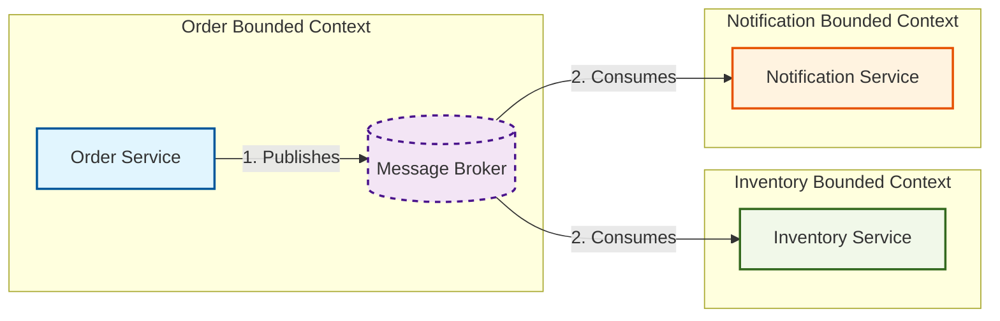

# مبانی Event-Driven Integration

> **توضیح:** با توجه به اینکه در درخواست عنوان دقیق به‌صورت `[عنوان موردنظر]` درج شده بود، این محتوا بر اساس اولین و بنیادی‌ترین بخش ساختار ارائه‌شده، یعنی **«مبانی Event-Driven Integration»** (شامل تعریف، نقش Bounded Context، Producer/Consumer، و ارتباط با Loose Coupling) تدوین شده است تا به‌عنوان پایه‌ای مستحکم و آماده‌ی درج در Repository آموزشی شما عمل کند.

---

## مقدمه

در معماری‌های نرم‌افزار مدرن، سیستم‌ها به‌ندرت به‌صورت جزیره‌ای عمل می‌کنند. آن‌ها نیاز به ارتباط با یکدیگر دارند تا فرآیندهای کسب‌وکار را تکمیل کنند. رویکرد سنتی، استفاده از فراخوانی‌های همگام (Synchronous) مانند REST API یا gRPC است. اما با رشد سیستم‌ها، این روش منجر به ایجاد وابستگی‌های شدید، کندی در پاسخ‌گویی و کاهش تاب‌آوری (Resilience) می‌شود. 

**Event-Driven Integration** (یکپارچه‌سازی رویدادمحور) به‌عنوان یک الگوی معماری، این چالش‌ها را با تغییر مدل ارتباطی از «درخواست-پاسخ» به «انتشار-اشتراک» (Publish-Subscribe) حل می‌کند. این فصل به شما کمک می‌کند تا مبانی این رویکرد را درک کرده و پایه‌ای صحیح برای طراحی سیستم‌های توزیع‌شده بسازید.

---

## مفهوم اصلی

### توضیح ساده
> اگر بخواهیم خیلی ساده بگوییم، Event-Driven Integration مانند سیستم اعلام حریق یا تابلو اعلانات یک رستوران است. 
> وقتی مشتری سفارشی ثبت می‌کند، گارسون (تولیدکننده یا Producer) سفارش را روی تابلو (Message Broker) می‌چسباند. آشپز (مصرف‌کننده یا Consumer) هر زمان که آماده بود، تابلو را نگاه می‌کند و غذا را آماده می‌کند. گارسون نیازی ندارد بداند آشپز دقیقاً کی یا چگونه غذا را می‌پزد؛ فقط اعلام می‌کند که «سفارش ثبت شد». این یعنی استقلال.

### توضیح فنی
در این الگو، یک سرویس (Producer) در پاسخ به یک تغییر وضعیت (State Change) یا وقوع یک عمل مهم در دامنه کسب‌وکار، یک **رویداد (Event)** را منتشر (Publish) می‌کند. این رویداد یک پیام غیرفعال (Passive Message) است که واقعیتی را که در گذشته رخ داده است، توصیف می‌کند (مثلاً `OrderCreated`). یک یا چند سرویس دیگر (Consumers) که به این رویداد علاقه‌مندند (Subscribed)، آن را دریافت کرده و به‌صورت ناهمگام (Asynchronously) واکنش مناسب را نشان می‌دهند. ارتباط از طریق یک واسطه (Message Broker مانند RabbitMQ، Kafka یا Azure Service Bus) مدیریت می‌شود.

---

## نقش Bounded Context در ارتباطات سیستم

در **Domain-Driven Design (DDD)**، یک **Bounded Context** مرز صریحی است که در آن یک مدل دامنه (Domain Model) خاص، معنا و تعریف دقیق دارد. 

یکی از اصول کلیدی DDD این است که Bounded Contextها باید تا حد امکان از یکدیگر مستقل باشند. استفاده از Event-Driven Integration بهترین مکانیزم برای ارتباط بین Bounded Contextهاست، زیرا:
1. از اشتراک‌گذاری پایگاه داده (Shared Database) جلوگیری می‌کند.
2. از وابستگی مستقیم به APIهای داخلی یکدیگر (Implementation Coupling) ممانعت می‌کند.
3. به هر تیم اجازه می‌دهد با سرعت مستقل خود توسعه دهد (Autonomous Teams).

رویدادها در اینجا به‌عنوان **Published Language** (زبان مشترک منتشرشده) عمل می‌کنند؛ قراردادی که بین Bounded Contextها برای تبادل معنا بدون افشای جزئیات پیاده‌سازی داخلی توافق شده است.

---

## مفهوم Producer و Consumer

| نقش | تعریف | مسئولیت اصلی |
| :--- | :--- | :--- |
| **Producer** (تولیدکننده) | سرویسی که تغییر وضعیت را تجربه می‌کند و رویداد را منتشر می‌سازد. | اطمینان از صحت داده‌های رویداد و انتشار آن در Broker. این سرویس نباید بداند چه کسی رویداد را مصرف می‌کند. |
| **Consumer** (مصرف‌کننده) | سرویسی که به رویداد گوش می‌دهد (Listen/Subscribe) و در پاسخ به آن کاری انجام می‌دهد. | پردازش رویداد، مدیریت خطاها، و اطمینان از Idempotency (یکپارچگی در پردازش تکراری). |

---

## چرا از Event برای ارتباط بین Bounded Contextها استفاده می‌کنیم؟

1. **استقلال تیم‌ها و سرویس‌ها**: تیم Order نیازی به هماهنگی با تیم Inventory برای انتشار یک آپدیت ندارد.
2. **مقیاس‌پذیری (Scalability)**: مصرف‌کنندگان می‌توانند به‌صورت مستقل و بر اساس بار کاری خود مقیاس بگیرند.
3. **تاب‌آوری (Resilience)**: اگر سرویس مصرف‌کننده موقتاً از دسترس خارج شود، پیام در Broker باقی می‌ماند و پس از بازگشت سرویس، پردازش می‌شود (برخلاف REST که با خطای Timeout مواجه می‌شود).
4. **پشتیبانی از فرآیندهای ناهمگام ذاتی**: بسیاری از فرآیندهای کسب‌وکار (مانند ارسال ایمیل تأیید یا به‌روزرسانی انبار) ذاتاً نیازی به پاسخ آنی ندارند.

---

## ارتباط Event-Driven Architecture و Loose Coupling

یک باور غلط رایج این است که "Event-Driven Coupling را حذف می‌کند". واقعیت این است که **Event-Driven Coupling را حذف نمی‌کند، بلکه نوع آن را تغییر می‌دهد**. باید انواع وابستگی را بشناسیم:

| نوع وابستگی (Coupling) | در ارتباط همگام (REST/RPC) | در ارتباط رویدادمحور (Event-Driven) |
| :--- | :--- | :--- |
| **Temporal Coupling** (وابستگی زمانی) | **بالا**: هر دو سرویس باید همزمان آنلاین باشند. | **پایین**: Producer و Consumer نیازی به همزمانی ندارند. |
| **Implementation Coupling** (وابستگی پیاده‌سازی) | **بالا**: تغییر در API یا فریم‌ورک یک سرویس، سرویس دیگر را می‌شکند. | **پایین**: ارتباط فقط از طریق یک Contract (قرارداد داده) مشخص است. |
| **Data Coupling** (وابستگی داده‌ای) | پایین (فقط داده‌های درخواست‌شده منتقل می‌شود). | **متغیر**: اگر رویداد حاوی داده‌های بسیار زیاد یا ساختار داخلی پایگاه داده باشد، وابستگی داده‌ای بالا می‌رود. |

**نکته معماری:** هدف ما رسیدن به **Loose Coupling** است، نه No Coupling. ما وابستگی زمانی و پیاده‌سازی را فدای مقدار کمی وابستگی داده‌ای (از طریق Event Contract) می‌کنیم.

---

## مثال واقعی: سیستم فروشگاه اینترنتی

بیایید یک سناریوی ثبت سفارش را بررسی کنیم:

* **Producer**: سرویس سفارش (Order Service)
* **Event**: `OrderPlaced` (شامل: `OrderId`, `CustomerId`, `OrderDate`, `List<OrderItem>`)
* **Consumers**: 
  1. سرویس انبار (Inventory Service): موجودی کالا را رزرو می‌کند.
  2. سرویس اعلان (Notification Service): ایمیل تأیید به مشتری ارسال می‌کند.
  3. سرویس تحلیل (Analytics Service): آمار فروش را به‌روزرسانی می‌کند.

**چرا این طراحی انتخاب شده است؟** 
چون فرآیند ارسال ایمیل یا به‌روزرسانی آمار نباید باعث تأخیر در پاسخ‌دهی به کاربر در لحظه ثبت سفارش شود. همچنین، اگر سرویس تحلیل از کار بیفتد، فرآیند اصلی ثبت سفارش نباید شکست بخورد.

**تأثیر بر Consistency**: 
سیستم وارد حالت **سازگاری نهایی (Eventual Consistency)** می‌شود. برای چند میلی‌ثانیه یا ثانیه، ممکن است سرویس انبار هنوز موجودی را رزرو نکرده باشد، اما در نهایت سیستم به یک وضعیت سازگار می‌رسد.

---

## مثال کدنویسی (C# / .NET)

در .NET مدرن، استفاده از `record` برای تعریف Eventها بهترین روش است، زیرا تغییرناپذیری (Immutability) را تضمین می‌کند.

### 1. تعریف Event Contract
```csharp
public record OrderPlacedIntegrationEvent(
    Guid OrderId,
    Guid CustomerId,
    DateTime OccurredOn,
    IReadOnlyList<OrderItemDto> Items
);

public record OrderItemDto(
    Guid ProductId,
    int Quantity,
    decimal UnitPrice
);
```

### 2. انتشار رویداد (Producer)
```csharp
public interface IEventPublisher
{
    Task PublishAsync<T>(T @event, CancellationToken cancellationToken = default) where T : class;
}

public class OrderService
{
    private readonly IEventPublisher _eventPublisher;
    // ... سایر وابستگی‌ها

    public async Task<Guid> CreateOrderAsync(CreateOrderCommand command, CancellationToken ct)
    {
        // 1. ذخیره سفارش در پایگاه داده
        var orderId = await _orderRepository.SaveAsync(command, ct);

        // 2. ساخت و انتشار رویداد
        var integrationEvent = new OrderPlacedIntegrationEvent(
            orderId, command.CustomerId, DateTime.UtcNow, command.Items);
            
        await _eventPublisher.PublishAsync(integrationEvent, ct);
        
        return orderId;
    }
}
```
*(نکته: در محیط تولید، برای تضمین اتمیک بودن ذخیره دیتابیس و انتشار رویداد، باید از **Outbox Pattern** استفاده کرد که در بخش‌های پیشرفته‌تر توضیح داده می‌شود).*

### 3. مصرف رویداد (Consumer) - با استفاده از MassTransit یا مشابه آن
```csharp
public class InventoryUpdateConsumer : IConsumer<OrderPlacedIntegrationEvent>
{
    private readonly IInventoryRepository _inventoryRepository;

    public InventoryUpdateConsumer(IInventoryRepository inventoryRepository)
    {
        _inventoryRepository = inventoryRepository;
    }

    public async Task Consume(ConsumeContext<OrderPlacedIntegrationEvent> context)
    {
        var @event = context.Message;
        
        // پردازش ناهمگام و Idempotent
        foreach (var item in @event.Items)
        {
            await _inventoryRepository.ReserveStockAsync(item.ProductId, item.Quantity, @event.OrderId);
        }
    }
}
```

---

## معماری و Diagram



**توضیح اجزا:**
1. **Order Service**: تغییر وضعیت را اعمال کرده و رویداد را به Broker می‌فرستد.
2. **Message Broker**: وظیفه ذخیره موقت و تحویل پیام به مشترکین (Subscribers) را بر عهده دارد.
3. **Inventory / Notification Services**: به‌صورت مستقل از Broker پیام را دریافت و پردازش می‌کنند. هیچ‌کدام از وجود دیگری آگاه نیستند.

---

## ارتباط با مفاهیم DDD

* **Domain Event**: رویدادی که درون یک Bounded Context رخ می‌دهد و برای هماهنگی بین Aggregateهای *همان* Context استفاده می‌شود (مثلاً `OrderSubmitted` درون سرویس سفارش).
* **Integration Event**: رویدادی که از مرز Bounded Context عبور می‌کند. یک Domain Event ممکن است به یک Integration Event ترجمه شود تا توسط Contextهای دیگر مصرف شود.
* **Anti-Corruption Layer (ACL)**: اگر Consumer نیاز داشته باشد داده‌های رویداد را به مدل دامنه داخلی خود تبدیل کند، از ACL استفاده می‌کند تا ساختار خارجی بر مدل داخلی تأثیر نگذارد.

---

## ارتباط با سیستم‌های توزیع‌شده (Distributed Systems)

هنگام استفاده از Event-Driven Integration، شما با واقعیت‌های سیستم‌های توزیع‌شده روبرو می‌شوید:
1. **Network Failure**: شبکه همیشه قابل اعتماد نیست. Broker باید پیام را ذخیره کند.
2. **At-least-once Delivery**: اکثر Brokerها تضمین می‌کنند پیام *حداقل یک بار* تحویل داده شود. این یعنی ممکن است یک پیام تکراری (Duplicate) ارسال شود.
3. **Idempotency**: مصرف‌کننده باید طوری طراحی شود که پردازش یک رویداد تکراری، نتیجه جانبی مضاعف ایجاد نکند (مثلاً با چک کردن `OrderId` در یک جدول پردازش‌شده‌ها).
4. **Ordering**: ترتیب رسیدن پیام‌ها در سیستم‌های توزیع‌شده تضمین‌شده نیست (مگر با تنظیمات خاص مثل Partition Key در Kafka). طراحی باید نسبت به جابجایی ترتیب رویدادها مقاوم باشد.

---

## مقایسه مفاهیم مشابه

| ویژگی | ارتباط همگام (REST/RPC) | Event-Driven Integration |
| :--- | :--- | :--- |
| **مدل ارتباطی** | درخواست-پاسخ (Request-Response) | انتشار-اشتراک (Fire-and-Forget / Pub-Sub) |
| **وابستگی زمانی** | بالا (هر دو باید آنلاین باشند) | پایین (ناهمگام) |
| **Consistency** | Strong Consistency (سازگاری قوی) | Eventual Consistency (سازگاری نهایی) |
| **پیچیدگی** | پایین (درک و دیباگ آسان) | بالا (نیاز به مدیریت خطا، Idempotency و Observability) |

---

## تصمیم‌گیری: چه زمانی از Event-Driven استفاده کنیم؟

### چه زمانی استفاده کنیم؟
* وقتی فرآیند پس‌زمینه می‌تواند ناهمگام باشد (مثل ارسال ایمیل، به‌روزرسانی گزارش).
* وقتی چندین سرویس مختلف نیاز به واکنش به یک تغییر واحد دارند.
* وقتی می‌خواهید وابستگی زمانی بین سرویس‌ها را حذف کنید تا تاب‌آوری افزایش یابد.

### چه زمانی استفاده **نکنیم**؟
* وقتی Consumer *باید* بلافاصله نتیجه را بداند تا فرآیند ادامه یابد (مثلاً تأیید موجودی کارت بانکی قبل از نهایی کردن سفارش). در این حالت، فراخوانی همگام (Synchronous) مناسب‌تر است.
* وقتی تیم یا زیرساخت لازم برای مدیریت پیچیدگی‌های سیستم‌های توزیع‌شده (مانند Dead Letter Queues و Distributed Tracing) را ندارید.

### Trade-off اصلی
شما **پیچیدگی عملیاتی (Operational Complexity)** و نیاز به **مدیریت سازگاری نهایی** را در ازای **مقیاس‌پذیری بالاتر** و **استقلال بیشتر سرویس‌ها** معامله می‌کنید.

---

## نکات معماری پیشرفته

1. **Outbox Pattern**: برای جلوگیری از از دست رفتن رویداد در صورت شکست پس از ذخیره دیتابیس و قبل از انتشار رویداد، ابتدا رویداد را در یک جدول `Outbox` در همان تراکنش دیتابیس ذخیره کنید، سپس یک فرآیند جداگانه آن را از Outbox خوانده و به Broker ارسال کند.
2. **Schema Evolution**: Event Contractها باید با گذشت زمان تکامل یابند. همیشه فیلدهای جدید را به‌صورت اختیاری (Optional) اضافه کنید و فیلدهای قدیمی را بلافاصله حذف نکنید (Backward Compatibility).
3. **Dead Letter Queue (DLQ)**: پیام‌هایی که بارها شکست خورده‌اند را در یک صف جداگانه قرار دهید تا دستی بررسی شوند، نه اینکه باعث مسدود شدن صف اصلی شوند.

---

## اشتباهات رایج

* **استفاده از Event برای درخواست-پاسخ همگام**: انتظار داشته باشید که Consumer بلافاصله پاسخ دهد (این کار Event-Driven را به یک RPC پیچیده تبدیل می‌کند).
* **انتشار Internal Domain Models**: فرستادن کل Entityهای پایگاه داده به‌عنوان Event. این کار باعث Data Coupling شدید می‌شود. رویداد باید فقط حاوی داده‌های مورد نیاز برای Consumer باشد.
* **نادیده گرفتن Idempotency**: فرض اینکه Message Broker هر پیام را دقیقاً یک بار تحویل می‌دهد (Exactly-once delivery در عمل بسیار نادر و پرهزینه است).
* **ایجاد زنجیره‌های طولانی رویداد**: سرویس A رویدادی منتشر می‌کند که B را تحریک می‌کند، سپس C و D. این کار ردیابی (Tracing) و دیباگ را به کابوس تبدیل می‌کند.

---

## ارتباط این مبحث با سایر مفاهیم

* **Bounded Context**: Event-Driven Integration مکانیزم اصلی ارتباط بین این مرزهاست.
* **Domain Event vs Integration Event**: اولی درون یک Context است، دومی برای عبور از مرزها طراحی و بهینه‌سازی شده است.
* **Consistency**: انتخاب این الگو به‌طور ذاتی به معنای پذیرش Eventual Consistency است.
* **Reliability & Idempotency**: برای جبران تحویل حداقل یک‌باره (At-least-once) پیام‌ها، پیاده‌سازی Idempotency در Consumer الزامی است.
* **Messaging**: زیرساخت (Broker) که این ارتباط را ممکن می‌سازد.

---

## جمع‌بندی

* **این مفهوم چیست؟** روشی برای ارتباط ناهمگام بین سرویس‌ها از طریق انتشار رویدادهای بیانگر تغییر وضعیت.
* **چرا مهم است؟** استقلال سرویس‌ها، مقیاس‌پذیری و تاب‌آوری در برابر شکست‌های جزئی را فراهم می‌کند.
* **چه زمانی استفاده می‌شود؟** وقتی چندین سرویس باید از یک تغییر آگاه شوند و نیازی به پاسخ فوری نیست.
* **مهم‌ترین Trade-off**: پذیرش پیچیدگی بیشتر در مدیریت داده‌ها و خطاها در ازای کاهش وابستگی زمانی و پیاده‌سازی.
* **اشتباهاتی که باید از آن‌ها دوری کرد**: نادیده گرفتن Idempotency، انتشار مدل‌های داخلی دیتابیس، و استفاده نادرست از رویداد برای ارتباط همگام.

---

## نکات کلیدی

1. رویداد (Event) بیانگر چیزی است که **در گذشته** رخ داده است، نه دستوری برای انجام کار در آینده (Command).
2. Event-Driven وابستگی را حذف نمی‌کند، بلکه آن را از نوع Temporal/Implementation به Data/Schema تغییر می‌دهد.
3. همیشه فرض کنید پیام‌ها ممکن است تکراری تحویل داده شوند؛ مصرف‌کننده باید Idempotent باشد.
4. برای تضمین انتشار رویداد همراه با تغییر دیتابیس، از الگوی Outbox استفاده کنید.
5. Event Contractها باید ساده، خودتوصیف‌گر و پایدار (Stable) باشند.

---

## تمرین‌ها

### تمرین 1 — Beginner
**سناریو**: در یک سیستم رزرو هتل، وقتی مشتری رزرو را لغو می‌کند، باید به سرویس پرداخت اطلاع داده شود تا پول بازگردانده شود و به سرویس ایمیل اطلاع داده شود تا ایمیل لغو ارسال شود.
**وظیفه**: Producer، Consumerها و نام پیشنهادی برای Event را مشخص کنید. آیا این ارتباط باید همگام باشد یا ناهمگام؟ چرا؟

### تمرین 2 — Intermediate
**سناریو**: سرویس `User Registration` یک رویداد `UserRegistered` منتشر می‌کند. سرویس `Loyalty Program` این رویداد را مصرف می‌کند تا به کاربر جدید 100 امتیاز بدهد.
**وظیفه**: یک نمونه کد C# برای `UserRegisteredIntegrationEvent` بنویسید. توضیح دهید چرا نباید کل Entity کاربر (شامل پسورد هش‌شده و تاریخچه لاگین) را در این رویداد قرار داد.

### تمرین 3 — Advanced
**سناریو**: شما در حال طراحی یک سیستم هستید که در آن `Order Service` رویداد `OrderShipped` را منتشر می‌کند. `Billing Service` این رویداد را دریافت کرده و فاکتور نهایی را صادر می‌کند. گاهی اوقات به دلیل باگ شبکه، این رویداد دو بار به `Billing Service` می‌رسد.
**وظیفه**: یک راهکار معماری (همراه با توضیح مفهومی یا کد) برای اطمینان از اینکه فاکتور فقط یک بار صادر می‌شود (Idempotency) ارائه دهید.

---

## سؤال‌های چهارگزینه‌ای

**1. اصلی‌ترین تفاوت Domain Event و Integration Event در چیست؟**
- الف) Domain Event در پایگاه داده ذخیره می‌شود، اما Integration Event خیر.
- ب) Domain Event برای ارتباط درون یک Bounded Context است، اما Integration Event برای ارتباط بین Bounded Contextها طراحی شده است.
- ج) Integration Event همیشه همگام (Synchronous) پردازش می‌شود.
- د) Domain Event فقط توسط Message Brokerها قابل درک است.
> **پاسخ صحیح: ب**  
> **توضیح**: طبق اصول DDD، Domain Eventها برای هماهنگی داخلی یک Aggregate یا Context هستند، در حالی که Integration Eventها برای عبور از مرزهای Context و با در نظر گرفتن ملاحظات سازگاری و نسخه‌بندی طراحی می‌شوند.

**2. کدام نوع Coupling در Event-Driven Integration به‌طور قابل توجهی کاهش می‌یابد؟**
- الف) Data Coupling
- ب) Temporal Coupling
- ج) Schema Coupling
- د) هیچ‌کدام
> **پاسخ صحیح: ب**  
> **توضیح**: از آنجا که ارتباط ناهمگام است، Producer و Consumer نیازی ندارند همزمان آنلاین باشند، بنابراین وابستگی زمانی (Temporal Coupling) حذف می‌شود.

**3. چرا فرض "Exactly-once Delivery" (تحویل دقیقاً یک‌باره) در سیستم‌های توزیع‌شده معمولاً یک اشتباه معماری است؟**
- الف) زیرا Message Brokerها این قابلیت را ندارند.
- ب) زیرا پیاده‌سازی آن بسیار پرهزینه است و معمولاً با پذیرش "At-least-once" و پیاده‌سازی Idempotency در Consumer، راه‌حل بهتری ارائه می‌شود.
- ج) زیرا رویدادها نباید تکراری باشند.
- د) زیرا باعث افزایش Latency می‌شود.
> **پاسخ صحیح: ب**  
> **توضیح**: تضمین Exactly-once در سطح شبکه بسیار پیچیده و پرهزینه است. الگوی استاندارد صنعت، پذیرش At-least-once در سطح Broker و مدیریت تکرار از طریق Idempotency در سطح Consumer است.

**4. در سناریوی ثبت سفارش، اگر سرویس ارسال ایمیل (Consumer) برای 2 ساعت از دسترس خارج باشد، چه اتفاقی باید بیفتد؟**
- الف) سرویس سفارش (Producer) باید با خطا مواجه شود و سفارش را لغو کند.
- ب) پیام باید در Message Broker باقی بماند و پس از بازگشت سرویس ایمیل، پردازش شود.
- ج) پیام باید فوراً دور ریخته شود تا صف شلوغ نشود.
- د) سرویس سفارش باید به‌صورت دستی ایمیل را ارسال کند.
> **پاسخ صحیح: ب**  
> **توضیح**: یکی از مزایای اصلی Event-Driven، تاب‌آوری (Resilience) است. Broker پیام را نگه می‌دارد تا Consumer پس از بازیابی، آن را پردازش کند.

**5. کدام مورد یک "اشتباه رایج" در طراحی Event Contract است؟**
- الف) استفاده از نوع داده `record` در C#.
- ب) شامل کردن تمام فیلدهای جدول پایگاه داده در رویداد برای جلوگیری از نیاز به Queryهای بعدی.
- ج) استفاده از GUID برای شناسه‌ها.
- د) افزودن فیلد `OccurredOn` برای ثبت زمان وقوع رویداد.
> **پاسخ صحیح: ب**  
> **توضیح**: این کار باعث ایجاد Data Coupling شدید می‌شود و جزئیات پیاده‌سازی داخلی (Internal Schema) را در معرض دید سایر سرویس‌ها قرار می‌دهد که اصل Loose Coupling را نقض می‌کند.

---

## منابع

1. **کتاب**: *Implementing Domain-Driven Design*  
   - نویسنده: Vaughn Vernon  
   - لینک: [Amazon / Official Publisher](https://www.amazon.com/Implementing-Domain-Driven-Design-Vaughn-Vernon/dp/0321834577)  
   - پوشش: فصل‌های مربوط به Domain Events و Integration بین Bounded Contextها.

2. **مقاله**: *What do you mean by "Event-Driven"?*  
   - نویسنده: Martin Fowler  
   - لینک: [martinfowler.com](https://martinfowler.com/articles/201701-event-driven.html)  
   - پوشش: تعریف دقیق Event-Driven Architecture و تمایز آن از سایر الگوها.

3. **مستندات رسمی**: *Asynchronous messaging in .NET*  
   - سازمان: Microsoft Learn  
   - لینک: [learn.microsoft.com](https://learn.microsoft.com/en-us/dotnet/architecture/microservices/architect-microservice-container-applications/asynchronous-message-based-communication)  
   - پوشش: پیاده‌سازی عملی، مزایا، و چالش‌های ارتباط ناهمگام در اکوسیستم .NET.

4. **کتاب**: *Enterprise Integration Patterns*  
   - نویسندگان: Gregor Hohpe, Bobby Woolf  
   - لینک: [Enterprise Integration Patterns](https://www.enterpriseintegrationpatterns.com/)  
   - پوشش: الگوهای بنیادی مانند Publish-Subscribe و Message Broker.

5. **مقاله**: *The Outbox Pattern*  
   - منبع: Microservices.io (Chris Richardson)  
   - لینک: [microservices.io](https://microservices.io/patterns/data/transactional-outbox.html)  
   - پوشش: راه‌حل تضمین اتمیک بودن ذخیره وضعیت و انتشار رویداد.